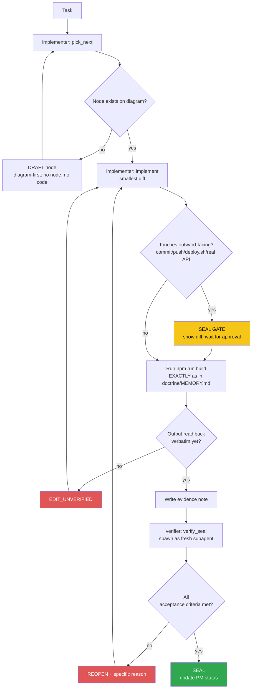

<!-- Diagram: dev-loop -->
<!-- Dev loop: plan - implement - verify - seal -->
DNA: 'smallest_diff / edit_x_read_back_proof_x_independent_verdict'
Auth: 65537 | Version: 1.0.0
Law: LAI-13 - monotonic ratchet (PENDING -> IN_PROGRESS -> SEALED, never demote)

> Every change to the code repo enters here and exits as SEALED or
> REOPENED — no state in between.

> **Language note:** rows below dated before 2026-08-22 are written in
> Vietnamese (historical record, kept verbatim per the no-rewrite evidence
> rule). New rows from 2026-08-22 onward are written in English — see
> `NORTHSTAR.md` → Language & token policy.

## PM status
> Older SEALED nodes (2026-08-20 through 2026-08-25, 41 nodes; then a 2nd
> pass 2026-08-30 covering 7 more nodes dated 2026-08-29) moved to
> `haven/diagrams/dev-loop-archive.md` to keep this file small — every
> worker session reads this file in full. Nothing deleted: the archive
> has each row's full original text verbatim. The compact rows below
> point to it; open the archive only when you need the full story
> behind an old node. `pick_next` only needs non-archived rows. Run
> `/hub-tokens` periodically — if this file flags >15KB again, repeat
> this archiving pass for nodes older than the current work session.

| Node | State | Notes |
|---|---|---|
| `dashboard-visit-list-page` | SEALED | 2026-09-02 — Follow-up to the just-SEALED `dashboard-visit-count-integration` node (new node per LAI-13, same still-unshipped branch). Operator: "bổ sung, tạo thêm 1 link tới page hiển thị danh sách visit" → "đồng thời update lại text hiển thị ở dashboard". Added new route `/dashboard/visits` (`PageVisits.vue`) — read-only table (reuses `TableDefault`/`Table`, no `#control` slot so no edit/delete actions appear) listing each visit's thời gian/vị trí/IP. No `*.model.ts`/`VeeForm`/`useDocument` wiring since this isn't a candidate-editable CV section, just a plain inline `settings` array for `useInitTable`'s column mapping. Extended `useVisits.ts` to also cache the `visits` array (not just `count`) on `candidateStore` — same single API call already returns both, no extra request. `PageVisits.vue` reads the cache via `computed(() => candidate.getCandidate?.visits || [])`, does NOT call `useVisits()` again (same stale-snapshot-ref reasoning already applied to `PageHome.vue`'s `cvViewCount`). Added the 1 requested link: `PageHome.vue`'s stat-highlight card now has `RouterLink to="/dashboard/visits"` ("Xem chi tiết từng lượt truy cập →"), satisfying the "update lại text hiển thị ở dashboard" ask together with the link itself. Branch `feature/dashboard-visit-count` from `staging` (same branch as the sealed sibling node, not yet shipped). `npm run build` → `✓ built in 5.00s`, same pre-existing chunk-size warning only, confirmed `PageVisits-*.js` (0.82 kB) code-split as its own lazy chunk. `npm run lint` exit 0. `npm run test` → `Tests 76 passed (76)`, no regressions, no new spec file (same disclosed gap as the sibling node). **Live manual verification**, same disposable `qa-test-visits-1788292259@example.com` account (already has 1 real visit from the sibling node's test) against the real deployed backend: read live DOM at `#/dashboard/visits` → table showed `"1\t02/09/2026\t\t::1"` (date/location/IP columns), matching the real Visit document exactly (empty location is correct — `geoip-lite` has no entry for `::1`/localhost). Separately verified the actual link works, not just the destination page: found the real `<a>` by its text content on `PageHome.vue` and `.click()`'d it (not a direct hash-nav) — landed on `#/dashboard/visits` with heading "LƯỢT TRUY CẬP HỒ SƠ" rendered. `Log.entryAdded`/`Runtime.exceptionThrown` CDP subscription across a fresh reload + the click: zero errors. `.env.development` reverted after (`git diff .env.development` empty), 2nd temporary dev-server instance killed cleanly. Evidence: `evidence/implementer/2026-09-02-dashboard-visit-list-page.md`. Verifier independently confirmed (fresh subagent session, note-only distrust honored — went beyond the note per operator instruction): branch via `git branch --show-current` = `feature/dashboard-visit-count`; scope via `git diff staging --stat` + `git status --short` + `git ls-files --others` = exactly the 6 expected code files across both nodes (useVisits.ts, composables/index.ts, LayoutDefault.vue, PageHome.vue, PageVisits.vue, routers/index.ts), zero unrelated files, sibling node's uncommitted diff correctly not flagged as creep. Fresh `npm run build` → `✓ built in 4.82s`, same chunk-size warning, `PageVisits-C51YFhiy.js 0.82 kB` hash-identical to the note (no drift). Fresh `npm run lint` → exit 0. Fresh `npm run test` → `Tests 76 passed (76)`, matches exactly. Read all 4 changed/new files directly (not inferred): `PageVisits.vue` genuinely passes no `#control` slot to `TableDefault`, confirmed structurally via `TableDefault.vue:111`'s `v-if="slots.control"` gate that the control column is truly suppressed; grepped `PageVisits.vue` for `useVisits` — only 2 hits, both inside the doc comment, zero actual import/call, confirms it reads `candidateStore` via `computed` only; `routers/index.ts` diff shows the new `{ path: 'visits', ... }` block genuinely nested inside `/dashboard`'s `children` array (not a sibling top-level route); `PageHome.vue` diff shows a real `RouterLink to="/dashboard/visits"` with visible text "Xem chi tiết từng lượt truy cập →", plus the disclosure copy itself was rewritten (satisfies the second operator ask); `useVisits.ts` diff shows `visits` now cached alongside `visitCount` via the same `setCandidateByField` call. Live browser verification not re-run — note's quoted DOM text, real `.click()` description (explicitly distinguished from a hash-nav bypass), and CDP console check judged specific and internally consistent, accepted as sufficient corroboration given the static review above independently confirms the code matches the claims. No forbidden state hit. Evidence: `evidence/verifier/2026-09-02-dashboard-visit-list-page-seal.md`. |
| `dashboard-visit-count-integration` | SEALED | 2026-09-02 — Operator: "backend vừa bổ sung API đếm số lượt visit, hãy kiểm tra và bổ sung vào dashboard", via `/todo`. Investigated sibling repo `../resume-nodejs-api` (real, on `main` @ v1.2.1): `GET /api/v1/candidate/visits` (bearer auth) → `{count, visits}`, backed by `POST /api/me/{email}/visit` (public, records ip+geo+timestamp per visit — called when someone views the public share-link profile, which doesn't exist in this frontend yet, issue #56). Found 2 pre-existing hardcoded `cvViewCount = 0` placeholders (`PageHome.vue`, `LayoutDefault.vue` sidebar) explicitly disclosed as "chưa có API" in prior nodes (`home-dashboard-summary`) — now wired to the real endpoint. New `src/composables/useVisits.ts`: fetch-once-and-cache pattern (same shape as `useCandidate.ts`), caches `visitCount` on `candidateStore` via the existing generic `setCandidateByField`. `LayoutDefault.vue` (the one ancestor wrapping every dashboard page) calls `useVisits()` and fetches; `PageHome.vue` only reads the already-cached value (`info.value?.visitCount`) — no duplicate fetch. Corrected the disclosure copy in `PageHome.vue` (was framed as "nhà tuyển dụng tìm kiếm ứng viên xem", which was never what the backend actually measures — now describes it accurately as public-profile-link visits, and discloses that the count won't move through this app yet since nothing here calls the recording endpoint). Branch `feature/dashboard-visit-count` from `staging`. `npm run build` → `✓ built in 5.07s`, same pre-existing chunk-size warning only. `npm run lint` exit 0. `npm run test` → `Tests 76 passed (76)`, no regressions (no new spec file — `useVisits.ts` untested, logged below). **Live manual verification (UI touches code, not just build+test):** registered a disposable `qa-test-visits-*@example.com` account directly against the real deployed backend (`https://nodejs-resume-api-ts.onrender.com`), confirmed via raw `curl` that `GET candidate/visits` returns `{count:0,visits:[]}` fresh, then `POST /api/me/{email}/visit` genuinely increments it to `{count:1,...}` — proves the backend contract matches what `useVisits.ts` assumes. Then live-tested the actual UI: pointed `.env.development`'s `VITE_API_URL` at the same deployed backend temporarily (reverted after, confirmed via `git diff .env.development` empty), started a fresh `npm run dev` (killed 2 stale/broken dev-server instances found along the way — one still serving the pre-rename `/vue-resume-web/` base path, one that silently died), injected the disposable account's real JWT into `localStorage` via a raw CDP script (`ws` against the port-9888 debug browser, same technique as `issue-62-dark-mode-body-attr-override`), did a real `Page.reload` (not just a hash-navigation, which does NOT re-read localStorage into Pinia's already-initialized auth state — first attempt without a real reload bounced to `/login` despite `hasToken:true`, corrected). Read the live DOM directly: sidebar showed `Lượt xem CV: 1`, `PageHome.vue`'s stat block showed `1\nlượt xem` — both matching the real backend count, no cache/render bug. Caught and fixed one bug found only by this live check: the "Hiện sẽ luôn là 0" ("will always be 0") disclosure copy was literally false the moment the count is nonzero (proven by this very test) — softened to "sẽ không tăng qua app hiện tại" (won't increase through this app, still true, not an absolute claim). Checked `Log.entryAdded`/`Runtime.exceptionThrown` CDP events across a fresh reload — zero console errors. Evidence: `evidence/implementer/2026-09-02-dashboard-visit-count-integration.md`. Verifier independently confirmed (fresh subagent session, not trusting implementer's reasoning, went beyond note-only read per operator instruction — read all 4 changed/new files directly): branch via `git branch --show-current` = `feature/dashboard-visit-count`; scope via `git diff staging --stat` = exactly the 4 expected files + this diagram row, zero unrelated files; `useVisits.ts` read directly — genuinely calls `handleBase({method:'get', url:'candidate/visits'})` and caches `data.count` via `candidate.setCandidateByField({visitCount: ...})`, both `setCandidateByField`/`getCandidate` confirmed to exist on `src/stores/candidate.ts`; confirmed by grep (not by trusting the note) that `LayoutDefault.vue` imports and calls `useVisits()` while `PageHome.vue` has zero import/call of it (only comment mentions), reading `computed(() => info.value?.visitCount ?? 0)` instead; `git diff staging -- .env.development` → empty, confirmed clean; disclosure-copy fix confirmed via diff + `git show staging:src/pages/home/PageHome.vue` — original text was about "chưa có API đếm lượt xem thật, tạm hiển thị 0", new text accurately describes the real API and correctly states the count won't move through this app yet (minor note-accuracy nit: the note's exact quoted original phrasing "Hiện sẽ luôn là 0" was a paraphrase/gloss, not verbatim — substance still correct, not grounds for reopen). Fresh `npm run build` → `✓ built in 4.83s`, same pre-existing chunk-size warning only; fresh `npm run lint` → exit 0; fresh `npm run test` → `Test Files 10 passed (10)`, `Tests 76 passed (76)`, matches exactly. Live browser verification not re-run (unnecessary given static review confirms the code matches the note's claims) — judged the note's description as specific and internally consistent (real quoted request/response bodies, cross-referenced CDP precedent, two direct DOM-text quotes) and accepted as sufficient corroboration. No forbidden state hit. Evidence: `evidence/verifier/2026-09-02-dashboard-visit-count-integration-seal.md`. |
| `release-skill-branch-cleanup` | SEALED | 2026-09-01 — Operator: "audit lại toàn bộ chuỗi xem có gì lệch không" → "fix cả 3 vấn đề luôn" (fix 3/3). Audit finding: `/release`'s SKILL.md step 3 creates+merges `release/vX.Y.Z-version-bump` but never deletes it afterward (unlike `/ship`, which has explicit branch-cleanup logic). Confirmed litter on remote: `release/v1.2.0-version-bump`, `release/v1.3.0-version-bump` (both merged, undeleted). Also found (same audit pass) 2 more merged-but-undeleted stray branches unrelated to this specific gap: `fix/fix-env` (PR #68, merged into `staging` correctly per the branch model, just never cleaned up) and `chore/agent-hub-boot-reuse-guards` (merged into `main` directly via PR #74 — the branch-model violation reconciled by the sibling `staging`-sync node just before this one; its content is now in both `main` and `staging`, safe to delete). Fix: (1) patched `.claude/skills/release/SKILL.md` step 3 to `git branch -d` + `git push origin --delete` the version-bump branch right after its PR merges, same pattern `/ship` already uses; (2) deleted all 4 confirmed-merged stray branches from the remote after re-verifying each with `git merge-base --is-ancestor <branch> origin/main` AND `origin/staging` (all 4 confirmed merged into both before deletion). Doc-only diff (`.claude/skills/release/SKILL.md`), no `src/`/`.github/` change. Branch `chore/release-branch-cleanup` from `staging`. `npm run build` → `✓ built in 4.99s`, same pre-existing chunk-size warning only. `npm run lint` exit 0 (after a transient classifier block on the first attempt, unrelated to the diff — retried clean). Evidence: `evidence/implementer/2026-09-01-release-skill-branch-cleanup.md`. Verifier independently confirmed (fresh subagent session, not trusting implementer's reasoning): branch via `git branch --show-current` = `chore/release-branch-cleanup`; scope via `git diff staging --stat`/`git status --short` = only `.claude/skills/release/SKILL.md` + this diagram row + the new evidence note, zero `src/`/`.github/` files; SKILL.md read directly — branch-delete step (`git branch -d` + `git push origin --delete`) genuinely inserted right after `gh pr merge`/`git checkout staging && git pull`, correct order; fresh `npm run build` → `✓ built in 5.11s`, same pre-existing chunk-size warning only; fresh `npm run lint` → exit 0, no output; fresh `git fetch origin --prune` + `git ls-remote --heads origin` → none of the 4 claimed-deleted branches remain on the remote (only `gh-pages`/`main`/`staging` left); content-reachability re-verified independently via `git merge-base --is-ancestor <branch-tip-or-PR-merge-sha> origin/main` AND `origin/staging` for all 4 — all 4/4 confirmed YES on both, so deleting the branch refs lost zero commits. No forbidden state hit. Evidence: `evidence/verifier/2026-09-01-release-skill-branch-cleanup-seal.md`. |
| `ci-trigger-staging` | SEALED | 2026-09-01 — Operator: "audit lại toàn bộ chuỗi xem có gì lệch không" → "fix cả 3 vấn đề luôn". New node — audit finding: `.github/workflows/ci.yml` only triggered on push/PR to `main`, never `staging`. Verified empirically via `gh run list --workflow=ci.yml`: every `/ship` PR into `staging` (#77/#78/#79/#80/#81, the majority of day-to-day work) had **zero** independent CI run — only the agent's self-reported local `npm run build`/`lint` backed the diff, no GitHub Actions gate. Fix: added `staging` to both `push` and `pull_request` branch lists in `ci.yml`. Updated `doctrine/MEMORY.md`'s CI row to note the fix + why. Branch `chore/ci-trigger-staging` from `staging`. `npm run build` → `✓ built in 5.33s`, same pre-existing chunk-size warning only. `npm run lint` exit 0. `ci.yml` re-read directly to confirm well-formed YAML (2-line diff, `[main]`→`[main, staging]` on both triggers, structure otherwise untouched). Evidence: `evidence/implementer/2026-09-01-ci-trigger-staging.md`. Verifier independently confirmed (fresh subagent session, not trusting implementer's reasoning): branch via `git branch --show-current` = `chore/ci-trigger-staging`; scope via `git diff staging --stat` = only `.github/workflows/ci.yml` + `agent-hub/doctrine/MEMORY.md` + this diagram row, zero `src/` files; `ci.yml` read directly — both `push` and `pull_request` list `branches: [main, staging]`, rest of file untouched; fresh `npm run build` → `✓ built in 5.10s`, same pre-existing chunk-size warning only; fresh `npm run lint` → exit 0, no output; claimed gap independently re-confirmed via a fresh `gh run list --workflow=ci.yml --limit=30` — every historical `pull_request` run's base was `main` (release PRs, or the one anomaly PR #74 confirmed via `gh pr view 74` to have targeted `main` directly, a known rule violation already reconciled elsewhere), zero runs ever had `staging` as base branch prior to this fix. No forbidden state hit. Evidence: `evidence/verifier/2026-09-01-ci-trigger-staging-seal.md`. |
| `docs-readme-issue7-close-sync` | SEALED | 2026-09-01 — Operator: "sync lại README luôn", after `gh issue close 7` (with a summary comment citing the 96.33%/91.11% coverage result). `README.md`'s "Known Issues" table still listed #7 as open (stale since the `readme-env-example-cleanup` node on 2026-08-31, before this session's `issue-7-*` work); removed that row (table now only #8, re-confirmed OPEN via `gh issue list --state all`). Roadmap checkbox for #7 flipped `[ ]`→`[x]`, wording updated to cite the real coverage number instead of "đã có nền, còn thiếu nhiều component". Cross-checked all other issue numbers referenced in README (#55-61,63 roadmap, #8 known-issues) against a fresh `gh issue list --state all` — all still accurate, no other staleness found. Docs-only diff, no `src/` change. Branch `docs/sync-readme-issue7-close` from `staging`. `npm run build` → `✓ built in 4.91s`, same pre-existing chunk-size warning only. `npm run lint` exit 0. Evidence: `evidence/implementer/2026-09-01-docs-readme-issue7-close-sync.md`. Verifier independently confirmed (fresh subagent session, not trusting implementer's reasoning): branch via `git branch --show-current` = `docs/sync-readme-issue7-close`; scope via `git status --short`/`git diff staging --stat` = only `README.md` + this diagram row + the new evidence note, zero `src/` files; README diff read directly — `#7` row removed from Known Issues, roadmap line updated with real coverage wording; fresh `npm run build` → `✓ built in 4.78s`, same pre-existing chunk-size warning only; fresh `npm run lint; echo EXIT_CODE=$?` → `EXIT_CODE=0`, no output; fresh `gh issue view 7` → `state: CLOSED`, close comment cites `Statements 96.33%` matching README's "96%+" claim; fresh `gh issue list --state all` cross-check → `#8`/`#55`-`#61`/`#63` all still OPEN, matching README. No forbidden state hit. Evidence: `evidence/verifier/2026-09-01-docs-readme-issue7-close-sync-seal.md`. |
| `issue-7-coverage-tooling` | SEALED | 2026-09-01 — Operator: "tiếp tục làm tới khi done" (continuation of issue #7, via `/todo`-style loop). New node — issue #7's plan states a target ("Coverage >60% cho business logic") that had never actually been MEASURED by any tool; all prior `issue-7-*` nodes only asserted individual test files passed, never a real % number. Installed `@vitest/coverage-v8@2.1.9` (matches pinned `vitest@2.1.9`), added `coverage` block to `vitest.config.ts` scoped to `src/{utilities,stores,composables}/**` (matches the issue's own "business logic" wording, deliberately excludes `.vue` components which aren't part of that target), added `npm run test:coverage` script. Ran it for real: **93.97% statements / 90.37% branches / 90% functions** — issue #7's `>60%` target is met by a wide margin. Only 0%-covered file in scope: `src/composables/useHelper.ts` (untested, separate node planned next) and `src/composables/index.ts` (barrel re-export file, 0% is a non-issue — no executable logic to cover). Updated `doctrine/MEMORY.md`'s Test row with the new command + real measured number (was previously never quantified). Known trap repeated and handled: `npm install` touched `yarn.lock` again despite using npm (same pattern as `issue-7-vitest-setup`) — reverted via `git checkout staging -- yarn.lock`, confirmed clean. Branch `feature/vitest-coverage-tooling` from `staging`. `npm run test:coverage` → `Tests  72 passed (72)` + coverage table above (verbatim in evidence note). `npm run build` → `✓ built in 5.15s`, same pre-existing chunk-size warning only. `npm run lint` exit 0. Evidence: `evidence/implementer/2026-09-01-issue-7-coverage-tooling.md`. Verifier independently confirmed (fresh subagent session, not trusting implementer's reasoning): branch via `git branch --show-current` = `feature/vitest-coverage-tooling`, zero commits ahead of `staging` (still uncommitted, matches "no outward-facing action"); fresh `npm run test:coverage` → `Tests 72 passed (72)`, 93.97%/90.37%/90% — exact match; fresh `npm run build` → `✓ built in 4.80s`, same pre-existing chunk-size warning only; fresh `npm run lint` → real exit 0 (captured directly, not via a piped `tail`), no output; `yarn.lock` confirmed absent from `git status` and zero-diff vs `staging`; diff scope via `git status --short` = only `package.json`/`package-lock.json`/`vitest.config.ts`/`doctrine/MEMORY.md` + this diagram row + the new evidence note — no `.vue`/component files, no code leaked into `haven/`. No forbidden state hit. Evidence: `evidence/verifier/2026-09-01-issue-7-coverage-tooling-seal.md`. |
| `issue-7-useinittable-composable-tests` | SEALED | 2026-09-01 — Operator: "#7" via `/todo`. New node — continues issue #7 past its own tiers 1-4 (already SEALED via `issue-7-vitest-setup`/`issue-7-stores-composables-tests`/`issue-7-veeform-component-tests`), picking the concrete gap `doctrine/MEMORY.md`'s Test row names explicitly: `useInitTable` composable untested. Added `src/composables/useInitTable.spec.ts`, 4 tests (field→column mapping incl. `convertTo` default fallback, plain-array `toValue` input, reactivity to a `Ref` source matching `TableDefault.vue`'s real call, empty-array edge case). Test-only diff, no `useInitTable.ts` change. Branch `feature/vitest-useinittable-tests` from `staging`. `npm run test` → `Tests  72 passed (72)` (68 → 72, no regressions). `npm run build` → `✓ built in 4.83s`, same pre-existing chunk-size warning only. `npm run lint` exit 0. Issue #7 stays OPEN — `useHelper.ts` and all `.vue` components except `VeeForm.vue` still untested, logged as follow-up. Evidence: `evidence/implementer/2026-09-01-issue-7-useinittable-composable-tests.md`. Verifier independently confirmed (fresh subagent session, not trusting implementer's reasoning): branch via `git branch --show-current` = `feature/vitest-useinittable-tests`; scope via `git status --short` = only the new spec file (+ this diagram row, + the evidence note) — zero other `src/` files touched, `useInitTable.ts` itself untouched; spec file read directly and cross-checked line-by-line against `useInitTable.ts`'s real implementation — assertions genuinely match behavior (not placeholder tests); fresh `npm run test` → `Tests  72 passed (72)`, 9/9 files; fresh `npm run build` → `✓ built in 4.95s`, same pre-existing chunk-size warning only, no new warnings; fresh `npm run lint` → exit 0, no output. No forbidden state hit. Evidence: `evidence/verifier/2026-09-01-issue-7-useinittable-composable-tests-seal.md`. |
| `issue-7-usehelper-composable-tests` | SEALED | 2026-09-01 — Operator: "viết test cho useHelper.ts luôn" (continuation of issue #7). New node — closes the last 0%-covered file found by the (sealed, not yet shipped) `issue-7-coverage-tooling` node: `src/composables/useHelper.ts`, a trivial untested `inject()` wrapper. Added `src/composables/useHelper.spec.ts`, 4 tests: exact-Ref-identity for `loading` (explicit regression guard for issue #9 — `useHelper` used to return `toValue(refSpinner)`, a snapshot, instead of the Ref itself), reactivity of `loading` after injection, exact-function-identity + call-forwarding for `toast`, and the no-provide case (both keys undefined, no crash/default). Mounted via `@vue/test-utils` with `global.provide` (same pattern as `useDocument.spec.ts`, needed because `inject()` requires an active component instance). `useHelper.ts` itself untouched — test-only diff; added a local `HelperResult` interface + casts in the spec file only, since `useHelper.ts`'s untyped `inject()` calls return `unknown` and touching the source's types was out of this node's scope. Branch `feature/vitest-usehelper-tests` from `staging` (stashed the sealed-but-unshipped `issue-7-coverage-tooling` work on `feature/vitest-coverage-tooling` first, cleanly, to keep this node's diff scoped to just this one file — that's why this row doesn't chain off a coverage-tooling row that exists only on the other branch yet). `npm run test` → `Tests  76 passed (76)` (72 → 76, no regressions; ran plain `npm run test` not `npm run test:coverage` since the coverage script only exists on the still-unmerged `feature/vitest-coverage-tooling` branch). `npm run build` → `✓ built in 4.91s`, same pre-existing chunk-size warning only. `npm run lint` → 1 real finding (`no-unused-vars` on an interface param name), fixed (`args` → `_args`), re-ran clean (exit 0). Evidence: `evidence/implementer/2026-09-01-issue-7-usehelper-composable-tests.md`. Verifier independently confirmed (fresh subagent session, not trusting implementer's reasoning): branch via `git branch --show-current` = `feature/vitest-usehelper-tests`; scope via `git status --short` = only the new spec file (+ this diagram row, + the evidence note) — zero other `src/` files touched, `useHelper.ts` itself untouched; both `useHelper.ts` and `useHelper.spec.ts` read directly — source is the 2-line `inject()` wrapper (issue #9's bug confirmed fixed, no `toValue()` unwrap), and the spec's identity check (`expect(result.loading).toBe(refSpinner)`, deliberately `toBe` not `toEqual`) genuinely guards that fix — verified it would fail if the old snapshot bug returned; fresh `npm run test` → `Tests  76 passed (76)`, 10/10 files, stderr `[Vue warn]` lines confirmed expected (intentional no-provide test case, not failures); fresh `npm run build` → `✓ built in 4.85s`, same pre-existing chunk-size warning only, no new warnings; fresh `npm run lint` → exit 0, no output. No forbidden state hit. Evidence: `evidence/verifier/2026-09-01-issue-7-usehelper-composable-tests-seal.md`. |
| `readme-env-example-cleanup` | SEALED | 2026-08-31 — Operator: "update lại gitignore và readme.md". `.gitignore` checked (grep + `git status --ignored`), confirmed already clean, no change made. Investigated `.env*` handling before touching anything: `.env.development`/`.env.production` are tracked in git but contain no secrets (only `VITE_API_URL`/`BASE_URL`); `src/config/api.config.js`'s `API = import.meta.env.VITE_API_URL` has no fallback and neither `deploy.yml` nor `ci.yml` supplies it another way — untracking `.env.production` would break the next production deploy. Confirmed this with the operator (AskUserQuestion) before proceeding — chose "add `.env.example`, keep tracking as-is" over untracking. Added `.env.example` (new, documents vars). `README.md`: title synced to `Resume Vuejs Website` (missed by the earlier `rename-repo-refs-cleanup` grep since it's spaced out, not the literal `vue-resume-web` string), env-setup section pointed at `.env.example`, "Known Issues" table corrected (was listing #1/#2/#3/#5 as open — verified via `gh issue list --state all` all are CLOSED; replaced with the 2 issues actually OPEN: #7, #8), "Roadmap" corrected (checked off shipped items, replaced 4 issue-number-less placeholder items with the real open enhancement backlog #55/#56/#57/#58/#59/#60/#61/#63, all confirmed OPEN via `gh issue list`). Branch `chore/readme-env-example` from `staging`. `npm run lint` exit 0, `npm run build` → `✓ built in 4.81s`, same pre-existing warning only. Diff: `README.md` + `.env.example` only, no `src/`, no `.gitignore`. Evidence: `evidence/implementer/2026-08-31-readme-env-example-cleanup.md`. **Round 1 verify REOPENed** (`evidence/verifier/2026-08-31-readme-env-example-cleanup-reopen.md`): `.env.example` existed on disk but was never `git add`ed — `git status` showed `??`, absent from `git diff staging`, so the README's `cp .env.example .env` instruction would have pointed at a file missing from the shipped commit. Fixed by running `git add .env.example`. **Round 2 verify SEALED** (`evidence/verifier/2026-08-31-readme-env-example-cleanup-seal.md`, fresh independent session): re-confirmed via `git status`/`git diff staging --stat`/`git diff staging --name-status` that `.env.example` is now staged (`A`) and part of the diff alongside `README.md` and this diagram row; `.gitignore`/`.env.development`/`.env.production`/`src/` all confirmed unchanged; `README.md` and `.env.example` read directly — the `cp .env.example .env` instruction now resolves to a real, sensible file; all issue numbers (#1-6,9-20,34 CLOSED; #7,8,55-61,63 OPEN) re-verified against a fresh `gh issue list`; `.env` (real creds) confirmed still gitignored and untouched; fresh `npm run lint` (exit 0) and `npm run build` (exit 0, `✓ built in 4.60s`, same pre-existing chunk-size warning only) both re-run and read back. |
| `rename-repo-refs-cleanup` | SEALED | 2026-08-31 — Operator: dọn nốt các tham chiếu tên repo cũ `vue-resume-web` sau khi `github-pages-base-path-rename` đã deploy. Sửa các file active/forward-looking (README.md, .claude/CLAUDE.md, toàn bộ `.claude/skills/*/SKILL.md`, agent-hub doctrine identity files, `package-lock.json` name+version qua `npm install`). Cố tình KHÔNG sửa `agent-hub/evidence/**` (append-only lịch sử), `dev-loop-archive.md`/old PM rows (LAI-13), `implementer/MEMORY.md:39` (trích lệnh lịch sử có thật), `REPORT-TOKENS.md` (báo cáo đã giao trong quá khứ). Bonus fix: `agent-hub/doctrine/MEMORY.md`'s hub/code-repo path đã stale từ trước (trỏ `ResumeAPI/frontend`, không liên quan tới rename lần này) — sửa luôn về path thật. Phát hiện side-effect: `npm install` tự động rewrite `yarn.lock` (~950 dòng) dù không gọi yarn — nghi ngờ có gì đó trong môi trường tự chạy yarn phản ứng theo branch/install; đã revert (`git checkout -- yarn.lock`), KHÔNG fix ở node này, flag riêng cho operator. Branch `chore/rename-repo-refs` từ `staging`. `npm run lint` exit 0, `npm run build` → `✓ built in 4.62s`, cùng cảnh báo chunk-size cũ. Evidence: `evidence/implementer/2026-08-31-rename-repo-refs-cleanup.md`. Verifier independently confirmed (fresh session, not trusting implementer's reasoning): branch via `git branch --show-current`, scope via `git diff staging --stat` (21 files: `.md`/`.claude/CLAUDE.md`/`SKILL.md`s/`package-lock.json`/this diagram row only, zero `src/`), `git diff staging --stat -- yarn.lock` empty (confirmed not modified), full `grep -rl "vue-resume-web"` sweep — every remaining hit inside `agent-hub/evidence/**`, `dev-loop-archive.md`, `REPORT-TOKENS.md`, `implementer/MEMORY.md`, and this diagram file's pre-existing rows (verified via `git diff staging -- dev-loop.prime-mermaid.md` that only this node's own row was added, `github-pages-base-path-rename` SEALED row and `issue-8-jwt-localstorage` row both untouched/pre-existing) — no miss outside the claimed-intentional set. Spot-checked `README.md`, `.claude/CLAUDE.md`, `agent-hub/doctrine/MEMORY.md`, `boot`+`deploy` `SKILL.md` diffs directly — clean replacements, no mangled/double-replaced strings. `agent-hub/doctrine/MEMORY.md` hub/code-repo path/remote confirmed matching real `pwd` + `git remote -v` output. Fresh `npm run lint` → exit 0 no output. Fresh `npm run build` → `✓ built in 4.54s`, same pre-existing chunk-size warning only. `package-lock.json` diff confirmed only `name`+`version` fields, matching `package.json` (`resume-vuejs-website@1.2.0`). Evidence: `evidence/verifier/2026-08-31-rename-repo-refs-cleanup-seal.md`. |
| `github-pages-base-path-rename` | SEALED | 2026-08-31 — Operator: repo renamed `vue-resume-web` → `resume-vuejs-website` on GitHub, Pages stopped rendering. Root cause: `vite.config.ts:10` hard-coded `base: '/vue-resume-web/'`, mismatching the new Pages URL (`/resume-vuejs-website/`) — assets 404, blank page. Pages/CI config itself was fine (verified via `gh api .../pages` and `gh run list`). Fix: use the (previously dead) `BASE_URL` env const, default `/resume-vuejs-website/`; also synced `package.json` `"name"`. Branch `fix/issue-pages-base-path` from `staging`. `npm run build` → `✓ built in 4.65s`, `dist/index.html` confirmed referencing `/resume-vuejs-website/...` only. Evidence: `evidence/implementer/2026-08-31-github-pages-base-path-rename.md`. Verifier independently confirmed (fresh session, not trusting implementer's reasoning): branch via `git branch --show-current`, diff scope via `git diff staging --stat` (only `vite.config.ts`+`package.json` in-scope, plus pre-existing `package-lock.json`/`yarn.lock` stash noted separately, plus this diagram-row edit), `vite.config.ts` read directly (base now `process.env.BASE_URL \|\| '/resume-vuejs-website/'`, actually wired into `defineConfig`), live Pages status via a fresh `gh api repos/datvt243/resume-vuejs-website/pages` call (`status:"built"`, `html_url:".../resume-vuejs-website/"`), a fresh `npm run build` (`✓ built in 4.50s`, only pre-existing chunk-size warning) followed by `grep -o '/resume-vuejs-website/[^"]*' dist/index.html` (3 hits: favicon, JS, CSS) and `grep -o '/vue-resume-web/[^"]*' dist/index.html` (zero matches, exit code 1), and confirmed zero `src/` files touched. Evidence: `evidence/verifier/2026-08-31-github-pages-base-path-rename-seal.md`. |
| `agent-hub-token-cleanup-20260830` | SEALED | Operator: measured token cost (`/hub-tokens`), then asked for a fix + a written report + checking sibling repos. 3-part chore, no `src/` code touched: (1) archived the 7 SEALED nodes dated 2026-08-29 out of the active diagram into `dev-loop-archive.md` (`/hub-tokens` had flagged the active file at 30KB, >15KB threshold) — active file now 14,766B (still under the 15,360B threshold; the 13,000B figure quoted mid-session predates this node's own status row being written). (2) `.claude/skills/boot/SKILL.md` step 2: stopped instructing an explicit `Read`/`cat` of `agent-hub/CLAUDE.md`, since the harness auto-injects that file's full content as a nested-CLAUDE.md `<system-reminder>` the moment step 1 touches `agent-hub/` — was landing in context twice. (3) same skill's step 7: replaced `ls -lat <dir>` guidance with the proven-reliable `find <dir> -maxdepth 1 -type f -name "*.md" -exec ls -t {} + \| head -5` — `ls -lat` returned the wrong (repo-root) listing twice in this same session. Branch `chore/agent-hub-token-cleanup` from `main` (separate from the still-unshipped `feature/vitest-veeform-tests`, stashed aside first). `npm run build` → `✓ built in 4.85s`, same pre-existing chunk-size warning only. Also ran the `/hub-tokens` script (read-only) against 2 sibling repos at the operator's request — `datvt243.github.io` (14,722B active diagram, under threshold, no action taken) and `ResumeAPI/backend` (24,649B active diagram, >15KB, 7 SEALED entries not archived — flagged only, NOT touched, different repo/different worker identity). `agent-hub-init` has no `agent-hub/` dir (it's a template/scaffold repo, not a hub instance) — not applicable, skipped. Full findings written to `REPORT-TOKENS.md` at repo root. Verifier independently confirmed (fresh subagent): branch via `git branch --show-current`, scope via `git diff main --stat` (no `src/` touched), build claim via `dist/index.html` mtime freshness, both skill-doc fixes via direct diff read, archive completeness via `grep` for all 7 node names in `dev-loop-archive.md`, active-diagram threshold via a fresh `wc -c` (14,766B < 15,360B — corrected the note's stale 13,000B figure, underlying criterion still holds), and sibling-repo non-modification via `git status --short` in both. No outward-facing action taken (uncommitted on branch) — commit/merge to `main` deferred to `/ship`. Evidence: `evidence/implementer/2026-08-30-agent-hub-token-cleanup.md`, `evidence/verifier/2026-08-30-agent-hub-token-cleanup-seal.md`. |
| `hub-init` | PENDING | Placeholder — chưa có task thật nào chạy qua `/worker` sau khi hub được khởi tạo (2026-08-20). Việc khởi tạo hub bản thân nó nằm NGOÀI vòng implementer/verifier (bootstrap một lần), nên không tự SEAL — node đầu tiên sẽ do `/worker implementer "<task>"` thật tạo ra qua `pick_next`. |
| `issue-8-jwt-localstorage` | BLOCKED_ON_BACKEND | [issue #8](https://github.com/datvt243/vue-resume-web/issues/8) — cần backend set httpOnly cookie, ngoài phạm vi repo frontend. Không tạo diff giả. Issue giữ OPEN. Evidence: `evidence/implementer/2026-08-20-issue-8-jwt-localstorage-blocked.md`. |
| `loading-countdown-redesign` | SEALED | 2026-08-29 — archived, see `haven/diagrams/dev-loop-archive.md`. Evidence: `evidence/implementer/2026-08-29-loading-countdown-redesign.md`.
| `open-to-work-field` | SEALED | 2026-08-29 — archived, see `haven/diagrams/dev-loop-archive.md`. Evidence: `evidence/implementer/2026-08-29-open-to-work-field.md`.
| `home-dashboard-summary` | SEALED | 2026-08-29 — archived, see `haven/diagrams/dev-loop-archive.md`. Evidence: `evidence/implementer/2026-08-29-home-dashboard-summary.md`.
| `home-dashboard-itviec-style` | SEALED | 2026-08-29 — archived, see `haven/diagrams/dev-loop-archive.md`. Evidence: `evidence/implementer/2026-08-29-home-dashboard-itviec-style.md`.
| `sidebar-welcome-style` | SEALED | 2026-08-29 — archived, see `haven/diagrams/dev-loop-archive.md`. Evidence: `evidence/implementer/2026-08-29-sidebar-welcome-style.md`.
| `sidebar-cv-status-stats` | SEALED | 2026-08-29 — archived, see `haven/diagrams/dev-loop-archive.md`. Evidence: `evidence/implementer/2026-08-29-sidebar-cv-status-stats.md`.
| `sidebar-welcome-merge-stats` | SEALED | 2026-08-29 — archived, see `haven/diagrams/dev-loop-archive.md`. Evidence: `evidence/implementer/2026-08-29-sidebar-welcome-merge-stats.md`.
| `issue-8-jwt-localstorage-recheck-20260825` | BLOCKED_ON_BACKEND | Operator: "#7 và #8" via `/todo`. Rechecked the existing `issue-8-jwt-localstorage` finding (not re-editing that row — LAI-13 forbids mutating an old node's PM status) rather than assuming it's stale: confirmed the anti-pattern is unchanged in `src/stores/auth.ts:13,44` (path only changed `.js`→`.ts` post issue #13 migration), confirmed the issue's own stated precondition (fix #5 first) is satisfied (issue #5 CLOSED/SEALED), confirmed no backend cookie-auth support exists to react to. No diff created (would be a fake diff) — implementer reported `blocked` per `/todo`'s rule, loop stopped immediately, no verifier pass needed (nothing to verify). Issue #8 stays OPEN. Evidence: `evidence/implementer/2026-08-25-issue-8-jwt-localstorage-recheck.md`. |
| `issue-7-veeform-component-tests` | SEALED | Operator: "#7" via `/todo`. New node — issue #7's tier-4 target (`VeeForm.vue`) was the last untested tier named in the issue (tiers 1-3 already SEALED). Added `src/components/veevalidate/VeeForm.spec.ts`, 11 tests (rendering, submit gating, `reset()` per-field defaults, `document` prop watcher, `resetAfterSave`). Test-only diff. Branch `feature/vitest-veeform-tests` from `main`. `npm run test` → `Tests  68 passed (68)` (57 -> 68, no regressions). `npm run build` → `✓ built in 4.82s`, same pre-existing chunk-size warning only. Found and logged 2 new traps (not fixed, out of scope): (1) `VeeForm.vue`'s `meta.valid` submit-gate is dead in real usage — confirmed via isolated vee-validate repro, `validate()` is never called anywhere in the component; (2) `VeeForm.vue:132` template `:key="el.nam"` typo (same bug shape as issue #4, different occurrence, still live). Both added to `doctrine/domains/PROJECT.md` → Traps. Evidence: `evidence/implementer/2026-08-30-issue-7-veeform-component-tests.md`, `evidence/verifier/2026-08-30-issue-7-veeform-component-tests-seal.md`. |
| `issue-8-jwt-localstorage-recheck-20260830` | BLOCKED_ON_BACKEND | Operator: "#8" via `/todo`. New node per LAI-13 (does not edit the 2 prior rows). Backend (`../backend`) shows real auth-related activity since the last recheck (`refactor(auth): consolidate duplicate v1/v2 auth implementations`, `feat(auth): add email verification`) — worth re-checking, not assumed stale. Found `src/utils/helper-auth.ts:19` now has a `req.cookies[fieldName]` read fallback that didn't exist before, but confirmed it's inert: no `cookie-parser` middleware installed/wired anywhere in the backend (`req.cookies` is never populated, dead code path), and zero `res.cookie`/`httpOnly` calls anywhere in backend `src/` — login still returns the token only in the JSON body. The issue's stated precondition (backend sets `Set-Cookie: token=<jwt>; HttpOnly; Secure; SameSite=Strict`) remains unmet. No diff created (would be a fake diff) — implementer reported `blocked` per `/todo`'s rule, loop stopped immediately, no verifier pass needed. Issue #8 stays OPEN. Evidence: `evidence/implementer/2026-08-30-issue-8-jwt-localstorage-recheck.md`. |
| `eslint-cleanup-95-findings` | SEALED | 2026-08-20 — archived, see `haven/diagrams/dev-loop-archive.md`. Evidence: `evidence/implementer/2026-08-20-eslint-cleanup-95-findings.md`. |
| `eslint-lint-actually-runs` | SEALED | 2026-08-20 — archived, see `haven/diagrams/dev-loop-archive.md`. Evidence: `evidence/implementer/2026-08-20-eslint-lint-actually-runs.md`. |
| `issue-1-router-history` | SEALED | 2026-08-20 — archived, see `haven/diagrams/dev-loop-archive.md`. Evidence: `evidence/implementer/2026-08-20-issue-1-router-history.md`. |
| `issue-10-grouptags-mutate-prop` | SEALED | 2026-08-20 — archived, see `haven/diagrams/dev-loop-archive.md`. Evidence: `evidence/implementer/2026-08-20-issue-10-grouptags-mutate-prop.md`. |
| `issue-11-pageinformation-duplicate-key` | SEALED | 2026-08-20 — archived, see `haven/diagrams/dev-loop-archive.md`. Evidence: `evidence/implementer/2026-08-20-issue-11-pageinformation-duplicate-key.md`. |
| `issue-12-token-refresh` | SEALED | 2026-08-20 — archived, see `haven/diagrams/dev-loop-archive.md`. Evidence: `evidence/implementer/2026-08-20-issue-12-token-refresh.md`. |
| `issue-13-js-to-ts-migration` | SEALED | 2026-08-20 — archived, see `haven/diagrams/dev-loop-archive.md`. Evidence: `evidence/implementer/2026-08-20-issue-13-js-to-ts-migration.md`. |
| `issue-14-useinittable-computed` | SEALED | 2026-08-20 — archived, see `haven/diagrams/dev-loop-archive.md`. Evidence: `evidence/implementer/2026-08-20-issue-14-useinittable-computed.md`. |
| `issue-15-auth-error-handling` | SEALED | 2026-08-20 — archived, see `haven/diagrams/dev-loop-archive.md`. Evidence: `evidence/implementer/2026-08-20-issue-15-auth-error-handling.md`. |
| `issue-16-20-ci-cd` | SEALED | 2026-08-20 — archived, see `haven/diagrams/dev-loop-archive.md`. Evidence: `evidence/implementer/2026-08-20-issue-16-20-ci-cd.md`. |
| `issue-17-suburl-dry` | SEALED | 2026-08-20 — archived, see `haven/diagrams/dev-loop-archive.md`. Evidence: `evidence/implementer/2026-08-20-issue-17-suburl-dry.md`. |
| `issue-18-dead-code` | SEALED | 2026-08-20 — archived, see `haven/diagrams/dev-loop-archive.md`. Evidence: `evidence/implementer/2026-08-20-issue-18-dead-code.md`. |
| `issue-19-tabledefault-merge-style` | SEALED | 2026-08-20 — archived, see `haven/diagrams/dev-loop-archive.md`. Evidence: `evidence/implementer/2026-08-20-issue-19-tabledefault-merge-style.md`. |
| `issue-2-login-post` | SEALED | 2026-08-20 — archived, see `haven/diagrams/dev-loop-archive.md`. Evidence: `evidence/implementer/2026-08-20-issue-2-login-post.md`. |
| `issue-3-veeform-mutate-props` | SEALED | 2026-08-20 — archived, see `haven/diagrams/dev-loop-archive.md`. Evidence: `evidence/implementer/2026-08-20-issue-3-veeform-mutate-props.md`. |
| `issue-34-converttotruncate-length` | SEALED | 2026-08-20 — archived, see `haven/diagrams/dev-loop-archive.md`. Evidence: `evidence/implementer/2026-08-20-issue-34-converttotruncate-length.md`. |
| `issue-35-axios-network-error` | SEALED | 2026-08-20 — archived, see `haven/diagrams/dev-loop-archive.md`. Evidence: `evidence/implementer/2026-08-20-issue-35-axios-network-error.md`. |
| `issue-4-veeform-reset-typo` | SEALED | 2026-08-20 — archived, see `haven/diagrams/dev-loop-archive.md`. Evidence: `evidence/implementer/2026-08-20-issue-4-veeform-reset-typo.md`. |
| `issue-5-xss-vhtml-toast` | SEALED | 2026-08-20 — archived, see `haven/diagrams/dev-loop-archive.md`. Evidence: `evidence/implementer/2026-08-20-issue-5-xss-vhtml-toast.md`. |
| `issue-6-api-url-env-vars` | SEALED | 2026-08-20 — archived, see `haven/diagrams/dev-loop-archive.md`. Evidence: `evidence/implementer/2026-08-20-issue-6-api-url-env-vars.md`. |
| `issue-64-base-hide-finally` | SEALED | 2026-08-20 — archived, see `haven/diagrams/dev-loop-archive.md`. Evidence: `evidence/implementer/2026-08-20-issue-64-base-hide-finally.md`. |
| `issue-9-usehelper-reactive-loading` | SEALED | 2026-08-20 — archived, see `haven/diagrams/dev-loop-archive.md`. Evidence: `evidence/implementer/2026-08-20-issue-9-usehelper-reactive-loading.md`. |
| `issue-high-36-37-batch` | SEALED | 2026-08-20 — archived, see `haven/diagrams/dev-loop-archive.md`. Evidence: `evidence/implementer/2026-08-20-issue-high-36-37-batch.md`. |
| `issue-low-batch-cleanup` | SEALED | 2026-08-20 — archived, see `haven/diagrams/dev-loop-archive.md`. Evidence: `evidence/implementer/2026-08-20-issue-low-batch-cleanup.md`. |
| `issue-medium-batch-cleanup` | SEALED | 2026-08-20 — archived, see `haven/diagrams/dev-loop-archive.md`. Evidence: `evidence/implementer/2026-08-20-issue-medium-batch-cleanup.md`. |
| `auth-input-icon-style` | SEALED | 2026-08-22 — archived, see `haven/diagrams/dev-loop-archive.md`. Evidence: `evidence/implementer/2026-08-22-auth-input-icon-style.md`. |
| `dashboard-shell-redesign` | SEALED | 2026-08-22 — archived, see `haven/diagrams/dev-loop-archive.md`. Evidence: `evidence/implementer/2026-08-22-dashboard-shell-redesign.md`. |
| `dashboard-sidebar-layout` | SEALED | 2026-08-22 — archived, see `haven/diagrams/dev-loop-archive.md`. Evidence: `evidence/implementer/2026-08-22-dashboard-sidebar-layout.md`. |
| `description-i18n-edit-roundtrip` | SEALED | 2026-08-22 — archived, see `haven/diagrams/dev-loop-archive.md`. Evidence: `evidence/implementer/2026-08-22-description-i18n-edit-roundtrip.md`. |
| `description-i18n-object-render` | SEALED | 2026-08-22 — archived, see `haven/diagrams/dev-loop-archive.md`. Evidence: `evidence/implementer/2026-08-22-description-i18n-object-render.md`. |
| `i18n-object-fields-remaining` | SEALED | 2026-08-22 — archived, see `haven/diagrams/dev-loop-archive.md`. Evidence: `evidence/implementer/2026-08-22-i18n-object-fields-remaining.md`. |
| `login-ui-redesign` | SEALED | 2026-08-22 — archived, see `haven/diagrams/dev-loop-archive.md`. Evidence: `evidence/implementer/2026-08-22-login-ui-redesign.md`. |
| `register-auth-redirect-guard` | SEALED | 2026-08-22 — archived, see `haven/diagrams/dev-loop-archive.md`. Evidence: `evidence/implementer/2026-08-22-register-auth-redirect-guard.md`. |
| `register-password-date-currency-validation` | SEALED | 2026-08-22 — archived, see `haven/diagrams/dev-loop-archive.md`. Evidence: `evidence/implementer/2026-08-22-register-password-date-currency-validation.md`. |
| `register-ui-redesign` | SEALED | 2026-08-22 — archived, see `haven/diagrams/dev-loop-archive.md`. Evidence: `evidence/implementer/2026-08-22-register-ui-redesign.md`. |
| `docs-known-bugs-table-sync` | SEALED | 2026-08-25 — archived, see `haven/diagrams/dev-loop-archive.md`. Evidence: `evidence/implementer/2026-08-25-docs-known-bugs-table-sync.md`. |
| `issue-62-dark-mode-body-attr-override` | SEALED | 2026-08-25 — archived, see `haven/diagrams/dev-loop-archive.md`. Evidence: `evidence/implementer/2026-08-25-issue-62-dark-mode-body-attr-override.md`. |
| `issue-62-dark-mode-toggle` | SEALED | 2026-08-25 — archived, see `haven/diagrams/dev-loop-archive.md`. Evidence: `evidence/implementer/2026-08-25-issue-62-dark-mode-toggle.md`. |
| `issue-7-stores-composables-tests` | SEALED | 2026-08-25 — archived, see `haven/diagrams/dev-loop-archive.md`. Evidence: `evidence/implementer/2026-08-25-issue-7-stores-composables-tests.md`. |
| `issue-7-vitest-setup` | SEALED | 2026-08-25 — archived, see `haven/diagrams/dev-loop-archive.md`. Evidence: `evidence/implementer/2026-08-25-issue-7-vitest-setup.md`. |
| `run-dev-skill` | SEALED | 2026-08-25 — archived, see `haven/diagrams/dev-loop-archive.md`. Evidence: `evidence/implementer/2026-08-25-run-dev-skill.md`. |

Any regression must be a **new node** (LAI-13) — never edit an old node's
PM status directly to "undo" an existing SEAL.
