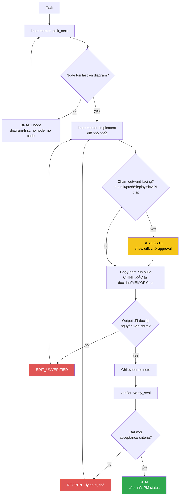

<!-- Diagram: dev-loop -->
<!-- Dev loop: plan - implement - verify - seal -->
DNA: 'smallest_diff / edit_x_read_back_proof_x_independent_verdict'
Auth: 65537 | Version: 1.0.0
Law: LAI-13 - monotonic ratchet (PENDING -> IN_PROGRESS -> SEALED, never demote)

> Mọi thay đổi tới repo code đi vào đây và đi ra bằng SEALED hoặc REOPENED —
> không có trạng thái nào khác ở giữa.

## PM status
| Node | State | Notes |
|---|---|---|
| `hub-init` | PENDING | Placeholder — chưa có task thật nào chạy qua `/worker` sau khi hub được khởi tạo (2026-08-20). Việc khởi tạo hub bản thân nó nằm NGOÀI vòng implementer/verifier (bootstrap một lần), nên không tự SEAL — node đầu tiên sẽ do `/worker implementer "<task>"` thật tạo ra qua `pick_next`. |
| `issue-1-router-history` | SEALED | [issue #1](https://github.com/datvt243/vue-resume-web/issues/1) — `createMemoryHistory` → `createWebHashHistory`. Evidence: `evidence/implementer/2026-08-20-issue-1-router-history.md`, `evidence/verifier/2026-08-20-issue-1-router-history.md`. |
| `issue-2-login-post` | SEALED | [issue #2](https://github.com/datvt243/vue-resume-web/issues/2) — login GET→POST, params→data. Backend cần chấp nhận POST body (ngoài phạm vi repo này). Evidence: `evidence/implementer/2026-08-20-issue-2-login-post.md`, `evidence/verifier/2026-08-20-issue-2-login-post.md`. |
| `issue-3-veeform-mutate-props` | SEALED | [issue #3](https://github.com/datvt243/vue-resume-web/issues/3) — `delete e.valid` → destructuring, hết mutate `props.fields`. Evidence: `evidence/implementer/2026-08-20-issue-3-veeform-mutate-props.md`, `evidence/verifier/2026-08-20-issue-3-veeform-mutate-props.md`. |
| `issue-4-veeform-reset-typo` | SEALED | [issue #4](https://github.com/datvt243/vue-resume-web/issues/4) — `e.nam`→`e.name`, sửa `reduce` thiếu initialValue, `errors:`→`values:`. Evidence: `evidence/implementer/2026-08-20-issue-4-veeform-reset-typo.md`, `evidence/verifier/2026-08-20-issue-4-veeform-reset-typo.md`. |
| `issue-5-xss-vhtml-toast` | SEALED | [issue #5](https://github.com/datvt243/vue-resume-web/issues/5) — bỏ `v-html` khỏi Toasts.vue, bỏ ` ` HTML khỏi base.js. Evidence: `evidence/implementer/2026-08-20-issue-5-xss-vhtml-toast.md`, `evidence/verifier/2026-08-20-issue-5-xss-vhtml-toast.md`. |
| `issue-8-jwt-localstorage` | BLOCKED_ON_BACKEND | [issue #8](https://github.com/datvt243/vue-resume-web/issues/8) — cần backend set httpOnly cookie, ngoài phạm vi repo frontend. Không tạo diff giả. Issue giữ OPEN. Evidence: `evidence/implementer/2026-08-20-issue-8-jwt-localstorage-blocked.md`. |
| `issue-9-usehelper-reactive-loading` | SEALED | [issue #9](https://github.com/datvt243/vue-resume-web/issues/9) — `useHelper` trả Ref thay vì snapshot; `base.js` + `auth.js` unwrap qua `toValue()`. Evidence: `evidence/implementer/2026-08-20-issue-9-usehelper-reactive-loading.md`, `evidence/verifier/2026-08-20-issue-9-usehelper-reactive-loading.md`. |
| `issue-10-grouptags-mutate-prop` | SEALED | [issue #10](https://github.com/datvt243/vue-resume-web/issues/10) — local copy + emit thay vì mutate prop; sửa luôn tên emit `modelValue:update`→`update:modelValue` (cần thiết để v-model hoạt động). Evidence: `evidence/implementer/2026-08-20-issue-10-grouptags-mutate-prop.md`, `evidence/verifier/2026-08-20-issue-10-grouptags-mutate-prop.md`. |
| `issue-11-pageinformation-duplicate-key` | SEALED | [issue #11](https://github.com/datvt243/vue-resume-web/issues/11) — 2 `<VeeForm>` cùng `:key="'frm1'"` → key riêng biệt. Evidence: `evidence/implementer/2026-08-20-issue-11-pageinformation-duplicate-key.md`, `evidence/verifier/2026-08-20-issue-11-pageinformation-duplicate-key.md`. |
| `issue-12-token-refresh` | SEALED | [issue #12](https://github.com/datvt243/vue-resume-web/issues/12) — lưu `tokenRefresh` + axios interceptor silent refresh khi 401. Cần backend có `POST auth/refresh` (ngoài phạm vi repo này, caveat ghi rõ). Evidence: `evidence/implementer/2026-08-20-issue-12-token-refresh.md`, `evidence/verifier/2026-08-20-issue-12-token-refresh.md`. |
| `issue-17-suburl-dry` | SEALED | [issue #17](https://github.com/datvt243/vue-resume-web/issues/17) — `subURL` gộp về `api.config.js` (chỉ phần DRY, không làm env-var migration của issue #6). Evidence: `evidence/implementer/2026-08-20-issue-17-suburl-dry.md`, `evidence/verifier/2026-08-20-issue-17-suburl-dry.md`. |
| `issue-18-dead-code` | SEALED | [issue #18](https://github.com/datvt243/vue-resume-web/issues/18) — xóa `handleBaseDelete`, `_part`, `components/navbar/*.js`, unused `ref`/`TOKEN`. Không bật ESLint rule (không verify được). Evidence: `evidence/implementer/2026-08-20-issue-18-dead-code.md`, `evidence/verifier/2026-08-20-issue-18-dead-code.md`. |
| `issue-19-tabledefault-merge-style` | SEALED | [issue #19](https://github.com/datvt243/vue-resume-web/issues/19) — gộp 2 khối `<style scoped>` trong TableDefault.vue thành 1. Evidence: `evidence/implementer/2026-08-20-issue-19-tabledefault-merge-style.md`, `evidence/verifier/2026-08-20-issue-19-tabledefault-merge-style.md`. |
| `issue-34-converttotruncate-length` | SEALED | [issue #34](https://github.com/datvt243/vue-resume-web/issues/34) — `ConvertToTruncate` gọi `value.length(25)` như hàm, crash Award/Experience list. Đổi thành so sánh độ dài + `slice`. Evidence: `evidence/implementer/2026-08-20-issue-34-converttotruncate-length.md`, `evidence/verifier/2026-08-20-issue-34-converttotruncate-length.md`. |
| `issue-35-axios-network-error` | SEALED | [issue #35](https://github.com/datvt243/vue-resume-web/issues/35) — `_axios` reject `err.response?.data` (undefined khi lỗi mạng), `base.js`/`auth.js` destructure thẳng → throw, spinner treo. Đổi sang fallback object mặc định khi không có `response`. Evidence: `evidence/implementer/2026-08-20-issue-35-axios-network-error.md`, `evidence/verifier/2026-08-20-issue-35-axios-network-error.md`. |
| `issue-low-batch-cleanup` | SEALED | Batch fix cho 9 issue LOW severity trong 1 commit (theo yêu cầu operator): [#46](https://github.com/datvt243/vue-resume-web/issues/46) Dropdown ref binding, [#47](https://github.com/datvt243/vue-resume-web/issues/47) FrmArray FieldArray/Field chưa import + hardcode name, [#48](https://github.com/datvt243/vue-resume-web/issues/48) FrmCheckbox thiếu `:` binding, [#49](https://github.com/datvt243/vue-resume-web/issues/49) regex số điện thoại, [#50](https://github.com/datvt243/vue-resume-web/issues/50) Header.vue dead prop `is-login`, [#51](https://github.com/datvt243/vue-resume-web/issues/51) LayoutDefault `$route.path`/`$route.fullPath` không nhất quán, [#52](https://github.com/datvt243/vue-resume-web/issues/52) đổi tên `generalInformation.modal.ts` → `.model.ts`, [#53](https://github.com/datvt243/vue-resume-web/issues/53) experience.model `_id` dùng `defaultId`, [#54](https://github.com/datvt243/vue-resume-web/issues/54) certificate.model thiếu `.trim()`. Evidence: `evidence/implementer/2026-08-20-issue-low-batch-cleanup.md`, `evidence/verifier/2026-08-20-issue-low-batch-cleanup.md`. |

| `issue-medium-batch-cleanup` | SEALED | Batch fix cho 8 issue MEDIUM severity trong 1 commit (theo yêu cầu operator): [#38](https://github.com/datvt243/vue-resume-web/issues/38) auth.js `logOut`/`clearUser` không xóa reactive user, [#39](https://github.com/datvt243/vue-resume-web/issues/39) logout tự động không clear candidateStore (fix chung với #38 — `clean()` gọi trong `logOut()`), [#40](https://github.com/datvt243/vue-resume-web/issues/40) dedupe request refresh-token đồng thời, [#41](https://github.com/datvt243/vue-resume-web/issues/41) useCandidate cache sai với field dạng object, [#42](https://github.com/datvt243/vue-resume-web/issues/42) PageProject `technology.join()` thiếu optional chaining, [#43](https://github.com/datvt243/vue-resume-web/issues/43) FrmCurrency ghi đè giá trị đã load về 0, [#44](https://github.com/datvt243/vue-resume-web/issues/44) kiểu dữ liệu ngày birthday & Award issueDate không nhất quán, [#45](https://github.com/datvt243/vue-resume-web/issues/45) PageAward/PageCertificate `handleDelete` field `'school'` sai → `'name'`. Evidence: `evidence/implementer/2026-08-20-issue-medium-batch-cleanup.md`, `evidence/verifier/2026-08-20-issue-medium-batch-cleanup.md`. |
| `issue-high-36-37-batch` | SEALED | Batch fix cho 2 issue HIGH còn lại trong 1 commit (theo yêu cầu operator): [#36](https://github.com/datvt243/vue-resume-web/issues/36) PageRegister repassword không so khớp password (thêm `yup.ref`), [#37](https://github.com/datvt243/vue-resume-web/issues/37) formatDate/formatDateToInput pad sai ngày/tháng = 9 (`< 9` → `< 10`). Evidence: `evidence/implementer/2026-08-20-issue-high-36-37-batch.md`, `evidence/verifier/2026-08-20-issue-high-36-37-batch.md`. |
| `issue-14-useinittable-computed` | SEALED | [issue #14](https://github.com/datvt243/vue-resume-web/issues/14) — `useInitTable` dùng `onMounted` (chạy 1 lần, gây layout flash + không reactive) → đổi sang `computed` + `toValue`, khớp cách `TableDefault.vue` gọi `useInitTable(toRef(props.settings))`. Evidence: `evidence/implementer/2026-08-20-issue-14-useinittable-computed.md`, `evidence/verifier/2026-08-20-issue-14-useinittable-computed.md`. |
| `issue-15-auth-error-handling` | SEALED | [issue #15](https://github.com/datvt243/vue-resume-web/issues/15) — `services/auth.js` mix `try/catch` ngoài với `.then()/.catch()` trong (`handleLogin`), `.catch()` trong nuốt lỗi khiến outer `catch` không bao giờ chạy (dead code) + `console.log` debug quên xoá. Refactor cả `handleLogin`/`handleRegister` về thuần `async/await` + `try/catch/finally`. Evidence: `evidence/implementer/2026-08-20-issue-15-auth-error-handling.md`, `evidence/verifier/2026-08-20-issue-15-auth-error-handling.md`. |
| `eslint-lint-actually-runs` | SEALED | Không phải issue GitHub — task trực tiếp từ operator: `npm run lint` trước đây crash ngay từ bước load config (`@rushstack/eslint-patch` thiếu, chưa từng khai báo trong `package.json`; `eslint-plugin-vue` cũng thiếu). Cài cả 2 + `eslint` (trước đây chỉ transitive) làm devDependencies, thêm `overrides` cho `.ts`/`.vue` trong `.eslintrc.cjs` (trước đây `.ts` không parse được — "Unexpected token interface"), thêm script `lint`. `npm run lint` giờ chạy thật, báo 95 lỗi có thật (chưa fix — ngoài scope). REOPEN lần 1 vì `yarn.lock` bị đổi ngoài khai báo (102 dòng) — đã revert + note đã sửa, verify lại pass toàn bộ. Evidence: `evidence/implementer/2026-08-20-eslint-lint-actually-runs.md`, `evidence/verifier/2026-08-20-eslint-lint-actually-runs.md`. |
| `eslint-cleanup-95-findings` | SEALED | Không phải issue GitHub — task trực tiếp từ operator: dọn 95 lỗi `npm run lint` phát hiện được ở node trước. 49 file. Phát hiện quan trọng: 9 file dùng `<template lang="pug">` (`vue-eslint-parser` không phân tích được usage trong pug) khiến nhiều biến bị báo "unused" SAI (false positive) — đã kiểm tra thủ công từng biến trong từng file trước khi quyết định xoá hay giữ, tránh xoá nhầm code đang thực sự được dùng. Verifier tự grep + đọc lại độc lập toàn bộ 17 lượt `eslint-disable-next-line no-unused-vars` trên 8 file pug, không tìm thấy biến nào bị xoá nhầm hay giữ nhầm. `npm run lint` xanh (0 lỗi), `npm run build` xanh, không có lockfile drift. Evidence: `evidence/implementer/2026-08-20-eslint-cleanup-95-findings.md`, `evidence/verifier/2026-08-20-eslint-cleanup-95-findings.md`. |
| `issue-13-js-to-ts-migration` | SEALED | [issue #13](https://github.com/datvt243/vue-resume-web/issues/13) — migrate 8 file `.js` → `.ts` theo đúng danh sách trong issue (`useHelper`, `routers/index`, `stores/auth`, `stores/candidate`, `services/axios`, `services/base`, `services/auth`, `main`), dùng `git mv` giữ nguyên nội dung. Sửa 2 chỗ tham chiếu bị vỡ do rename: `index.html` (`/src/main.js` → `/src/main.ts`), `App.vue` (`from '@/services/base.js'` → bỏ extension). Không thêm type annotation mới (ngoài scope, issue chỉ yêu cầu rename để nhất quán). Evidence: `evidence/implementer/2026-08-20-issue-13-js-to-ts-migration.md`, `evidence/verifier/2026-08-20-issue-13-js-to-ts-migration.md`. |
| `issue-16-20-ci-cd` | SEALED | [issue #16](https://github.com/datvt243/vue-resume-web/issues/16) + [issue #20](https://github.com/datvt243/vue-resume-web/issues/20) — gộp 2 issue theo yêu cầu operator (issue #20 tự ghi "Implement cùng với issue #16"). Thêm `.github/workflows/ci.yml` (lint + build, chạy trên push/PR vào `main` — KHÔNG có bước typecheck vì `vue-tsc` hiện không tương thích version TypeScript của dự án, verified độc lập bởi verifier). Thêm `.github/workflows/deploy.yml` (build + lint + `peaceiris/actions-gh-pages@v4`, tự chạy khi push `main`, cần `permissions: contents: write`). Xoá hẳn `deploy.sh` theo đúng đề xuất issue #16. Cập nhật `/deploy` skill (giờ chỉ check status qua `gh run`, không tự trigger nữa) + `doctrine/MEMORY.md` + `.claude/CLAUDE.md`. **CAVEAT SEAL — đọc trước khi coi node này là "đã confirm chạy production":** SEAL này dựa trên evidence local thôi (YAML hợp lệ + `npm run lint`/`npm run build` xanh + diff đúng phạm vi) — sandbox KHÔNG có GitHub Actions runner nên workflow thật CHƯA từng được chạy. Việc CI/Deploy thật sự pass/fail trên GitHub chỉ biết được SAU KHI merge vào `main` và quan sát `gh run list`/`gh run view` — đừng nhầm SEAL này là "đã confirm chạy được trên GitHub". Evidence: `evidence/implementer/2026-08-20-issue-16-20-ci-cd.md`, `evidence/verifier/2026-08-20-issue-16-20-ci-cd.md`. **CẬP NHẬT SAU SHIP:** cả 2 workflow đã chạy thật thành công lần đầu trên GitHub Actions (`gh run watch --exit-status` → exit 0 cho cả CI và Deploy), xem correction trong evidence implementer. |
| `issue-64-base-hide-finally` | SEALED | [issue #64](https://github.com/datvt243/vue-resume-web/issues/64) — `services/base.ts` `handleFrameFetch`: `hide()` nằm sau `try/catch`, không phải `finally` → nếu `action?.()` throw thật, spinner treo vĩnh viễn. Đổi `hide()` vào `finally`, bỏ outer `catch` chết (action tự `.catch()` bên trong, không bao giờ throw ra ngoài với code hiện tại). Đúng cách fix đề xuất trong issue #64 (issue này do chính hub phát hiện trong lúc verify fix #15). Evidence: `evidence/implementer/2026-08-20-issue-64-base-hide-finally.md`, `evidence/verifier/2026-08-20-issue-64-base-hide-finally.md`. |
| `issue-6-api-url-env-vars` | SEALED | [issue #6](https://github.com/datvt243/vue-resume-web/issues/6) — `src/config/api.config.js` hardcode `host === 'localhost' ? ... : 'https://nodejs-resume-api-ts.onrender.com/'`. Thêm `.env.development`/`.env.production` (`VITE_API_URL`), đổi `API` sang đọc `import.meta.env.VITE_API_URL`. GIỮ `subURL = 'api/v1/'` như hằng số riêng (không gộp vào `VITE_API_URL` như ví dụ trong issue) vì `Header.vue` có endpoint `api/me/${email}` KHÔNG đi qua `api/v1/` — gộp sẽ phá endpoint đó (verifier đọc trực tiếp `Header.vue`, xác nhận `getMe()` dùng `${host}api/me/...` và `getFile()` dùng `${host}api/v1/download-pdf`, khớp claim). `.gitignore` đã có sẵn `*.local` che `.env.*.local`, không cần sửa thêm — verifier tự `git check-ignore -v .env.production.local` xác nhận. Verify độc lập bởi verifier: `npm run build` xanh + `onrender.com/` có trong `dist/assets/*.js`, `npm run lint` exit 0, `npm run dev` + curl xác nhận `VITE_API_URL: "http://localhost:3001/"`. **CAVEAT SEAL:** `.env.production` không thực sự là file mới như note ghi ("mới") — file này đã tồn tại trên `main` với nội dung `BASE_URL=/vue-resume-web/`, bị ghi đè hoàn toàn. Không phải regression: `BASE_URL` vẫn còn trong `.env` (base, áp dụng mọi mode) và dù sao cũng là dead code trong `vite.config.ts` (`const base = process.env.BASE_URL || '/'` được gán nhưng không bao giờ dùng — `base:` field hardcode `'/vue-resume-web/'`). Ghi nhận là lỗi ghi chú (evidence-accuracy), không phải lỗi chức năng. **CẬP NHẬT (re-verify pass 2, sau correction):** implementer đã viết lại `.env.production` giữ CẢ 2 dòng (`BASE_URL=/vue-resume-web/` + `VITE_API_URL=...`) — verifier tự `cat`/`git diff main -- .env.production` xác nhận không còn mất dòng nào, `npm run build`/`npm run lint` vẫn xanh, `onrender.com/` vẫn baked đúng trong `dist/assets/*.js`. Caveat coi như đã resolved. Evidence: `evidence/implementer/2026-08-20-issue-6-api-url-env-vars.md`, `evidence/verifier/2026-08-20-issue-6-api-url-env-vars.md`. |

| `login-ui-redesign` | SEALED | Task trực tiếp từ operator (không phải GitHub issue): "Update lại giao diện trang login cho đẹp hơn". Scope: chỉ `src/pages/auth/PageLogin.vue` (card layout, vertical centering, dark-theme styling khớp accent xanh `#00d095` sẵn có trong `bootstrap.scss`) — không đụng `VeeForm.vue` (trap #3/#4), không đụng `LayoutAuth.vue` (shared với Register/NotFound, ngoài scope "trang login"). Evidence: `evidence/implementer/2026-08-22-login-ui-redesign.md`, `evidence/verifier/2026-08-22-login-ui-redesign-seal.md`. |
| `register-ui-redesign` | SEALED | Task trực tiếp từ operator, nối tiếp `login-ui-redesign` trong cùng phiên ("update luôn cho page register"): áp cùng pattern `.auth-card` cho `src/pages/auth/PageRegister.vue`, cùng branch `feature/login-page-ui-redesign` (theo yêu cầu operator, không tách branch riêng). Không đụng `VeeForm.vue`/`LayoutAuth.vue`. Evidence: `evidence/implementer/2026-08-22-register-ui-redesign.md`, `evidence/verifier/2026-08-22-register-ui-redesign-seal.md`. |
| `auth-input-icon-style` | SEALED | Task trực tiếp từ operator, nối tiếp `login-ui-redesign`/`register-ui-redesign` cùng phiên ("về input, bỏ label, thay vào kiểu icon + input"). Operator xác nhận qua AskUserQuestion: CHỈ áp dụng cho login/register, KHÔNG đổi toàn app. `FrmInput.vue`/`FrmPwd.vue` (`src/components/veevalidate/part/`) là component DÙNG CHUNG cho mọi form trong app — thêm prop `icon` OPT-IN (không truyền = hành vi cũ y nguyên, label vẫn hiện) để không ảnh hưởng các form khác (education, experience...). Chỉ `PageLogin.vue`/`PageRegister.vue` truyền `icon` cho field email/password/repassword (`fa-solid fa-envelope`/`fa-solid fa-lock`, đăng ký thêm vào `initFontAwesomeIcon.js`). Cùng branch `feature/login-page-ui-redesign`. Evidence: `evidence/implementer/2026-08-22-auth-input-icon-style.md`, `evidence/verifier/2026-08-22-auth-input-icon-style-seal.md`. |

**Correction (2026-08-22, sau SEAL, evidence-accuracy only):** operator yêu cầu đổi tên branch cho khớp scope thật (login + register + shared input component, không chỉ "login page"). Branch `feature/login-page-ui-redesign` đã `git branch -m` thành `feature/auth-ui-redesign` (LOCAL, chưa từng push nên không cần force-push/PR update). 3 evidence note trên (implementer + verifier của `login-ui-redesign`/`register-ui-redesign`/`auth-input-icon-style`) vẫn ghi tên branch CŨ — không sửa lại các file evidence đó (đúng lúc viết, `KHÔNG BAO GIỜ XOÁ`/không rewrite evidence), chỉ ghi correction ở đây để tránh lệch khi đối chiếu `git branch --show-current` trong tương lai. PM status không đổi (vẫn SEALED, ratchet không lùi).

Any regression phải là **node mới** (LAI-13) — không được sửa trực tiếp PM
status của node cũ để "gỡ" một SEAL đã có.
