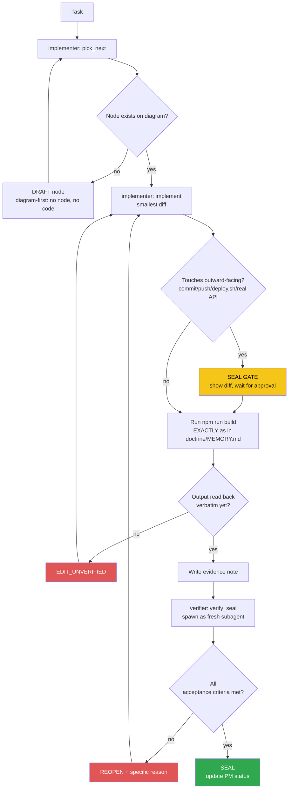

<!-- Diagram: dev-loop -->
<!-- Dev loop: plan - implement - verify - seal -->
DNA: 'smallest_diff / edit_x_read_back_proof_x_independent_verdict'
Auth: 65537 | Version: 1.0.0
Law: LAI-13 - monotonic ratchet (PENDING -> IN_PROGRESS -> SEALED, never demote)

> Every change to the code repo enters here and exits as SEALED or
> REOPENED — no state in between.

> **Language note:** rows below dated before 2026-08-22 are written in
> Vietnamese (historical record, kept verbatim per the no-rewrite evidence
> rule). New rows from 2026-08-22 onward are written in English — see
> `NORTHSTAR.md` → Language & token policy.

## PM status
> Older SEALED nodes (2026-08-20 through 2026-08-25, 41 nodes; then a 2nd
> pass 2026-08-30 covering 7 more nodes dated 2026-08-29) moved to
> `haven/diagrams/dev-loop-archive.md` to keep this file small — every
> worker session reads this file in full. Nothing deleted: the archive
> has each row's full original text verbatim. The compact rows below
> point to it; open the archive only when you need the full story
> behind an old node. `pick_next` only needs non-archived rows. Run
> `/hub-tokens` periodically — if this file flags >15KB again, repeat
> this archiving pass for nodes older than the current work session.

| Node | State | Notes |
|---|---|---|
| `rename-repo-refs-cleanup` | SEALED | 2026-08-31 — Operator: dọn nốt các tham chiếu tên repo cũ `vue-resume-web` sau khi `github-pages-base-path-rename` đã deploy. Sửa các file active/forward-looking (README.md, .claude/CLAUDE.md, toàn bộ `.claude/skills/*/SKILL.md`, agent-hub doctrine identity files, `package-lock.json` name+version qua `npm install`). Cố tình KHÔNG sửa `agent-hub/evidence/**` (append-only lịch sử), `dev-loop-archive.md`/old PM rows (LAI-13), `implementer/MEMORY.md:39` (trích lệnh lịch sử có thật), `REPORT-TOKENS.md` (báo cáo đã giao trong quá khứ). Bonus fix: `agent-hub/doctrine/MEMORY.md`'s hub/code-repo path đã stale từ trước (trỏ `ResumeAPI/frontend`, không liên quan tới rename lần này) — sửa luôn về path thật. Phát hiện side-effect: `npm install` tự động rewrite `yarn.lock` (~950 dòng) dù không gọi yarn — nghi ngờ có gì đó trong môi trường tự chạy yarn phản ứng theo branch/install; đã revert (`git checkout -- yarn.lock`), KHÔNG fix ở node này, flag riêng cho operator. Branch `chore/rename-repo-refs` từ `staging`. `npm run lint` exit 0, `npm run build` → `✓ built in 4.62s`, cùng cảnh báo chunk-size cũ. Evidence: `evidence/implementer/2026-08-31-rename-repo-refs-cleanup.md`. Verifier independently confirmed (fresh session, not trusting implementer's reasoning): branch via `git branch --show-current`, scope via `git diff staging --stat` (21 files: `.md`/`.claude/CLAUDE.md`/`SKILL.md`s/`package-lock.json`/this diagram row only, zero `src/`), `git diff staging --stat -- yarn.lock` empty (confirmed not modified), full `grep -rl "vue-resume-web"` sweep — every remaining hit inside `agent-hub/evidence/**`, `dev-loop-archive.md`, `REPORT-TOKENS.md`, `implementer/MEMORY.md`, and this diagram file's pre-existing rows (verified via `git diff staging -- dev-loop.prime-mermaid.md` that only this node's own row was added, `github-pages-base-path-rename` SEALED row and `issue-8-jwt-localstorage` row both untouched/pre-existing) — no miss outside the claimed-intentional set. Spot-checked `README.md`, `.claude/CLAUDE.md`, `agent-hub/doctrine/MEMORY.md`, `boot`+`deploy` `SKILL.md` diffs directly — clean replacements, no mangled/double-replaced strings. `agent-hub/doctrine/MEMORY.md` hub/code-repo path/remote confirmed matching real `pwd` + `git remote -v` output. Fresh `npm run lint` → exit 0 no output. Fresh `npm run build` → `✓ built in 4.54s`, same pre-existing chunk-size warning only. `package-lock.json` diff confirmed only `name`+`version` fields, matching `package.json` (`resume-vuejs-website@1.2.0`). Evidence: `evidence/verifier/2026-08-31-rename-repo-refs-cleanup-seal.md`. |
| `github-pages-base-path-rename` | SEALED | 2026-08-31 — Operator: repo renamed `vue-resume-web` → `resume-vuejs-website` on GitHub, Pages stopped rendering. Root cause: `vite.config.ts:10` hard-coded `base: '/vue-resume-web/'`, mismatching the new Pages URL (`/resume-vuejs-website/`) — assets 404, blank page. Pages/CI config itself was fine (verified via `gh api .../pages` and `gh run list`). Fix: use the (previously dead) `BASE_URL` env const, default `/resume-vuejs-website/`; also synced `package.json` `"name"`. Branch `fix/issue-pages-base-path` from `staging`. `npm run build` → `✓ built in 4.65s`, `dist/index.html` confirmed referencing `/resume-vuejs-website/...` only. Evidence: `evidence/implementer/2026-08-31-github-pages-base-path-rename.md`. Verifier independently confirmed (fresh session, not trusting implementer's reasoning): branch via `git branch --show-current`, diff scope via `git diff staging --stat` (only `vite.config.ts`+`package.json` in-scope, plus pre-existing `package-lock.json`/`yarn.lock` stash noted separately, plus this diagram-row edit), `vite.config.ts` read directly (base now `process.env.BASE_URL \|\| '/resume-vuejs-website/'`, actually wired into `defineConfig`), live Pages status via a fresh `gh api repos/datvt243/resume-vuejs-website/pages` call (`status:"built"`, `html_url:".../resume-vuejs-website/"`), a fresh `npm run build` (`✓ built in 4.50s`, only pre-existing chunk-size warning) followed by `grep -o '/resume-vuejs-website/[^"]*' dist/index.html` (3 hits: favicon, JS, CSS) and `grep -o '/vue-resume-web/[^"]*' dist/index.html` (zero matches, exit code 1), and confirmed zero `src/` files touched. Evidence: `evidence/verifier/2026-08-31-github-pages-base-path-rename-seal.md`. |
| `agent-hub-token-cleanup-20260830` | SEALED | Operator: measured token cost (`/hub-tokens`), then asked for a fix + a written report + checking sibling repos. 3-part chore, no `src/` code touched: (1) archived the 7 SEALED nodes dated 2026-08-29 out of the active diagram into `dev-loop-archive.md` (`/hub-tokens` had flagged the active file at 30KB, >15KB threshold) — active file now 14,766B (still under the 15,360B threshold; the 13,000B figure quoted mid-session predates this node's own status row being written). (2) `.claude/skills/boot/SKILL.md` step 2: stopped instructing an explicit `Read`/`cat` of `agent-hub/CLAUDE.md`, since the harness auto-injects that file's full content as a nested-CLAUDE.md `<system-reminder>` the moment step 1 touches `agent-hub/` — was landing in context twice. (3) same skill's step 7: replaced `ls -lat <dir>` guidance with the proven-reliable `find <dir> -maxdepth 1 -type f -name "*.md" -exec ls -t {} + \| head -5` — `ls -lat` returned the wrong (repo-root) listing twice in this same session. Branch `chore/agent-hub-token-cleanup` from `main` (separate from the still-unshipped `feature/vitest-veeform-tests`, stashed aside first). `npm run build` → `✓ built in 4.85s`, same pre-existing chunk-size warning only. Also ran the `/hub-tokens` script (read-only) against 2 sibling repos at the operator's request — `datvt243.github.io` (14,722B active diagram, under threshold, no action taken) and `ResumeAPI/backend` (24,649B active diagram, >15KB, 7 SEALED entries not archived — flagged only, NOT touched, different repo/different worker identity). `agent-hub-init` has no `agent-hub/` dir (it's a template/scaffold repo, not a hub instance) — not applicable, skipped. Full findings written to `REPORT-TOKENS.md` at repo root. Verifier independently confirmed (fresh subagent): branch via `git branch --show-current`, scope via `git diff main --stat` (no `src/` touched), build claim via `dist/index.html` mtime freshness, both skill-doc fixes via direct diff read, archive completeness via `grep` for all 7 node names in `dev-loop-archive.md`, active-diagram threshold via a fresh `wc -c` (14,766B < 15,360B — corrected the note's stale 13,000B figure, underlying criterion still holds), and sibling-repo non-modification via `git status --short` in both. No outward-facing action taken (uncommitted on branch) — commit/merge to `main` deferred to `/ship`. Evidence: `evidence/implementer/2026-08-30-agent-hub-token-cleanup.md`, `evidence/verifier/2026-08-30-agent-hub-token-cleanup-seal.md`. |
| `hub-init` | PENDING | Placeholder — chưa có task thật nào chạy qua `/worker` sau khi hub được khởi tạo (2026-08-20). Việc khởi tạo hub bản thân nó nằm NGOÀI vòng implementer/verifier (bootstrap một lần), nên không tự SEAL — node đầu tiên sẽ do `/worker implementer "<task>"` thật tạo ra qua `pick_next`. |
| `issue-8-jwt-localstorage` | BLOCKED_ON_BACKEND | [issue #8](https://github.com/datvt243/vue-resume-web/issues/8) — cần backend set httpOnly cookie, ngoài phạm vi repo frontend. Không tạo diff giả. Issue giữ OPEN. Evidence: `evidence/implementer/2026-08-20-issue-8-jwt-localstorage-blocked.md`. |
| `loading-countdown-redesign` | SEALED | 2026-08-29 — archived, see `haven/diagrams/dev-loop-archive.md`. Evidence: `evidence/implementer/2026-08-29-loading-countdown-redesign.md`.
| `open-to-work-field` | SEALED | 2026-08-29 — archived, see `haven/diagrams/dev-loop-archive.md`. Evidence: `evidence/implementer/2026-08-29-open-to-work-field.md`.
| `home-dashboard-summary` | SEALED | 2026-08-29 — archived, see `haven/diagrams/dev-loop-archive.md`. Evidence: `evidence/implementer/2026-08-29-home-dashboard-summary.md`.
| `home-dashboard-itviec-style` | SEALED | 2026-08-29 — archived, see `haven/diagrams/dev-loop-archive.md`. Evidence: `evidence/implementer/2026-08-29-home-dashboard-itviec-style.md`.
| `sidebar-welcome-style` | SEALED | 2026-08-29 — archived, see `haven/diagrams/dev-loop-archive.md`. Evidence: `evidence/implementer/2026-08-29-sidebar-welcome-style.md`.
| `sidebar-cv-status-stats` | SEALED | 2026-08-29 — archived, see `haven/diagrams/dev-loop-archive.md`. Evidence: `evidence/implementer/2026-08-29-sidebar-cv-status-stats.md`.
| `sidebar-welcome-merge-stats` | SEALED | 2026-08-29 — archived, see `haven/diagrams/dev-loop-archive.md`. Evidence: `evidence/implementer/2026-08-29-sidebar-welcome-merge-stats.md`.
| `issue-8-jwt-localstorage-recheck-20260825` | BLOCKED_ON_BACKEND | Operator: "#7 và #8" via `/todo`. Rechecked the existing `issue-8-jwt-localstorage` finding (not re-editing that row — LAI-13 forbids mutating an old node's PM status) rather than assuming it's stale: confirmed the anti-pattern is unchanged in `src/stores/auth.ts:13,44` (path only changed `.js`→`.ts` post issue #13 migration), confirmed the issue's own stated precondition (fix #5 first) is satisfied (issue #5 CLOSED/SEALED), confirmed no backend cookie-auth support exists to react to. No diff created (would be a fake diff) — implementer reported `blocked` per `/todo`'s rule, loop stopped immediately, no verifier pass needed (nothing to verify). Issue #8 stays OPEN. Evidence: `evidence/implementer/2026-08-25-issue-8-jwt-localstorage-recheck.md`. |
| `issue-7-veeform-component-tests` | SEALED | Operator: "#7" via `/todo`. New node — issue #7's tier-4 target (`VeeForm.vue`) was the last untested tier named in the issue (tiers 1-3 already SEALED). Added `src/components/veevalidate/VeeForm.spec.ts`, 11 tests (rendering, submit gating, `reset()` per-field defaults, `document` prop watcher, `resetAfterSave`). Test-only diff. Branch `feature/vitest-veeform-tests` from `main`. `npm run test` → `Tests  68 passed (68)` (57 -> 68, no regressions). `npm run build` → `✓ built in 4.82s`, same pre-existing chunk-size warning only. Found and logged 2 new traps (not fixed, out of scope): (1) `VeeForm.vue`'s `meta.valid` submit-gate is dead in real usage — confirmed via isolated vee-validate repro, `validate()` is never called anywhere in the component; (2) `VeeForm.vue:132` template `:key="el.nam"` typo (same bug shape as issue #4, different occurrence, still live). Both added to `doctrine/domains/PROJECT.md` → Traps. Evidence: `evidence/implementer/2026-08-30-issue-7-veeform-component-tests.md`, `evidence/verifier/2026-08-30-issue-7-veeform-component-tests-seal.md`. |
| `issue-8-jwt-localstorage-recheck-20260830` | BLOCKED_ON_BACKEND | Operator: "#8" via `/todo`. New node per LAI-13 (does not edit the 2 prior rows). Backend (`../backend`) shows real auth-related activity since the last recheck (`refactor(auth): consolidate duplicate v1/v2 auth implementations`, `feat(auth): add email verification`) — worth re-checking, not assumed stale. Found `src/utils/helper-auth.ts:19` now has a `req.cookies[fieldName]` read fallback that didn't exist before, but confirmed it's inert: no `cookie-parser` middleware installed/wired anywhere in the backend (`req.cookies` is never populated, dead code path), and zero `res.cookie`/`httpOnly` calls anywhere in backend `src/` — login still returns the token only in the JSON body. The issue's stated precondition (backend sets `Set-Cookie: token=<jwt>; HttpOnly; Secure; SameSite=Strict`) remains unmet. No diff created (would be a fake diff) — implementer reported `blocked` per `/todo`'s rule, loop stopped immediately, no verifier pass needed. Issue #8 stays OPEN. Evidence: `evidence/implementer/2026-08-30-issue-8-jwt-localstorage-recheck.md`. |
| `eslint-cleanup-95-findings` | SEALED | 2026-08-20 — archived, see `haven/diagrams/dev-loop-archive.md`. Evidence: `evidence/implementer/2026-08-20-eslint-cleanup-95-findings.md`. |
| `eslint-lint-actually-runs` | SEALED | 2026-08-20 — archived, see `haven/diagrams/dev-loop-archive.md`. Evidence: `evidence/implementer/2026-08-20-eslint-lint-actually-runs.md`. |
| `issue-1-router-history` | SEALED | 2026-08-20 — archived, see `haven/diagrams/dev-loop-archive.md`. Evidence: `evidence/implementer/2026-08-20-issue-1-router-history.md`. |
| `issue-10-grouptags-mutate-prop` | SEALED | 2026-08-20 — archived, see `haven/diagrams/dev-loop-archive.md`. Evidence: `evidence/implementer/2026-08-20-issue-10-grouptags-mutate-prop.md`. |
| `issue-11-pageinformation-duplicate-key` | SEALED | 2026-08-20 — archived, see `haven/diagrams/dev-loop-archive.md`. Evidence: `evidence/implementer/2026-08-20-issue-11-pageinformation-duplicate-key.md`. |
| `issue-12-token-refresh` | SEALED | 2026-08-20 — archived, see `haven/diagrams/dev-loop-archive.md`. Evidence: `evidence/implementer/2026-08-20-issue-12-token-refresh.md`. |
| `issue-13-js-to-ts-migration` | SEALED | 2026-08-20 — archived, see `haven/diagrams/dev-loop-archive.md`. Evidence: `evidence/implementer/2026-08-20-issue-13-js-to-ts-migration.md`. |
| `issue-14-useinittable-computed` | SEALED | 2026-08-20 — archived, see `haven/diagrams/dev-loop-archive.md`. Evidence: `evidence/implementer/2026-08-20-issue-14-useinittable-computed.md`. |
| `issue-15-auth-error-handling` | SEALED | 2026-08-20 — archived, see `haven/diagrams/dev-loop-archive.md`. Evidence: `evidence/implementer/2026-08-20-issue-15-auth-error-handling.md`. |
| `issue-16-20-ci-cd` | SEALED | 2026-08-20 — archived, see `haven/diagrams/dev-loop-archive.md`. Evidence: `evidence/implementer/2026-08-20-issue-16-20-ci-cd.md`. |
| `issue-17-suburl-dry` | SEALED | 2026-08-20 — archived, see `haven/diagrams/dev-loop-archive.md`. Evidence: `evidence/implementer/2026-08-20-issue-17-suburl-dry.md`. |
| `issue-18-dead-code` | SEALED | 2026-08-20 — archived, see `haven/diagrams/dev-loop-archive.md`. Evidence: `evidence/implementer/2026-08-20-issue-18-dead-code.md`. |
| `issue-19-tabledefault-merge-style` | SEALED | 2026-08-20 — archived, see `haven/diagrams/dev-loop-archive.md`. Evidence: `evidence/implementer/2026-08-20-issue-19-tabledefault-merge-style.md`. |
| `issue-2-login-post` | SEALED | 2026-08-20 — archived, see `haven/diagrams/dev-loop-archive.md`. Evidence: `evidence/implementer/2026-08-20-issue-2-login-post.md`. |
| `issue-3-veeform-mutate-props` | SEALED | 2026-08-20 — archived, see `haven/diagrams/dev-loop-archive.md`. Evidence: `evidence/implementer/2026-08-20-issue-3-veeform-mutate-props.md`. |
| `issue-34-converttotruncate-length` | SEALED | 2026-08-20 — archived, see `haven/diagrams/dev-loop-archive.md`. Evidence: `evidence/implementer/2026-08-20-issue-34-converttotruncate-length.md`. |
| `issue-35-axios-network-error` | SEALED | 2026-08-20 — archived, see `haven/diagrams/dev-loop-archive.md`. Evidence: `evidence/implementer/2026-08-20-issue-35-axios-network-error.md`. |
| `issue-4-veeform-reset-typo` | SEALED | 2026-08-20 — archived, see `haven/diagrams/dev-loop-archive.md`. Evidence: `evidence/implementer/2026-08-20-issue-4-veeform-reset-typo.md`. |
| `issue-5-xss-vhtml-toast` | SEALED | 2026-08-20 — archived, see `haven/diagrams/dev-loop-archive.md`. Evidence: `evidence/implementer/2026-08-20-issue-5-xss-vhtml-toast.md`. |
| `issue-6-api-url-env-vars` | SEALED | 2026-08-20 — archived, see `haven/diagrams/dev-loop-archive.md`. Evidence: `evidence/implementer/2026-08-20-issue-6-api-url-env-vars.md`. |
| `issue-64-base-hide-finally` | SEALED | 2026-08-20 — archived, see `haven/diagrams/dev-loop-archive.md`. Evidence: `evidence/implementer/2026-08-20-issue-64-base-hide-finally.md`. |
| `issue-9-usehelper-reactive-loading` | SEALED | 2026-08-20 — archived, see `haven/diagrams/dev-loop-archive.md`. Evidence: `evidence/implementer/2026-08-20-issue-9-usehelper-reactive-loading.md`. |
| `issue-high-36-37-batch` | SEALED | 2026-08-20 — archived, see `haven/diagrams/dev-loop-archive.md`. Evidence: `evidence/implementer/2026-08-20-issue-high-36-37-batch.md`. |
| `issue-low-batch-cleanup` | SEALED | 2026-08-20 — archived, see `haven/diagrams/dev-loop-archive.md`. Evidence: `evidence/implementer/2026-08-20-issue-low-batch-cleanup.md`. |
| `issue-medium-batch-cleanup` | SEALED | 2026-08-20 — archived, see `haven/diagrams/dev-loop-archive.md`. Evidence: `evidence/implementer/2026-08-20-issue-medium-batch-cleanup.md`. |
| `auth-input-icon-style` | SEALED | 2026-08-22 — archived, see `haven/diagrams/dev-loop-archive.md`. Evidence: `evidence/implementer/2026-08-22-auth-input-icon-style.md`. |
| `dashboard-shell-redesign` | SEALED | 2026-08-22 — archived, see `haven/diagrams/dev-loop-archive.md`. Evidence: `evidence/implementer/2026-08-22-dashboard-shell-redesign.md`. |
| `dashboard-sidebar-layout` | SEALED | 2026-08-22 — archived, see `haven/diagrams/dev-loop-archive.md`. Evidence: `evidence/implementer/2026-08-22-dashboard-sidebar-layout.md`. |
| `description-i18n-edit-roundtrip` | SEALED | 2026-08-22 — archived, see `haven/diagrams/dev-loop-archive.md`. Evidence: `evidence/implementer/2026-08-22-description-i18n-edit-roundtrip.md`. |
| `description-i18n-object-render` | SEALED | 2026-08-22 — archived, see `haven/diagrams/dev-loop-archive.md`. Evidence: `evidence/implementer/2026-08-22-description-i18n-object-render.md`. |
| `i18n-object-fields-remaining` | SEALED | 2026-08-22 — archived, see `haven/diagrams/dev-loop-archive.md`. Evidence: `evidence/implementer/2026-08-22-i18n-object-fields-remaining.md`. |
| `login-ui-redesign` | SEALED | 2026-08-22 — archived, see `haven/diagrams/dev-loop-archive.md`. Evidence: `evidence/implementer/2026-08-22-login-ui-redesign.md`. |
| `register-auth-redirect-guard` | SEALED | 2026-08-22 — archived, see `haven/diagrams/dev-loop-archive.md`. Evidence: `evidence/implementer/2026-08-22-register-auth-redirect-guard.md`. |
| `register-password-date-currency-validation` | SEALED | 2026-08-22 — archived, see `haven/diagrams/dev-loop-archive.md`. Evidence: `evidence/implementer/2026-08-22-register-password-date-currency-validation.md`. |
| `register-ui-redesign` | SEALED | 2026-08-22 — archived, see `haven/diagrams/dev-loop-archive.md`. Evidence: `evidence/implementer/2026-08-22-register-ui-redesign.md`. |
| `docs-known-bugs-table-sync` | SEALED | 2026-08-25 — archived, see `haven/diagrams/dev-loop-archive.md`. Evidence: `evidence/implementer/2026-08-25-docs-known-bugs-table-sync.md`. |
| `issue-62-dark-mode-body-attr-override` | SEALED | 2026-08-25 — archived, see `haven/diagrams/dev-loop-archive.md`. Evidence: `evidence/implementer/2026-08-25-issue-62-dark-mode-body-attr-override.md`. |
| `issue-62-dark-mode-toggle` | SEALED | 2026-08-25 — archived, see `haven/diagrams/dev-loop-archive.md`. Evidence: `evidence/implementer/2026-08-25-issue-62-dark-mode-toggle.md`. |
| `issue-7-stores-composables-tests` | SEALED | 2026-08-25 — archived, see `haven/diagrams/dev-loop-archive.md`. Evidence: `evidence/implementer/2026-08-25-issue-7-stores-composables-tests.md`. |
| `issue-7-vitest-setup` | SEALED | 2026-08-25 — archived, see `haven/diagrams/dev-loop-archive.md`. Evidence: `evidence/implementer/2026-08-25-issue-7-vitest-setup.md`. |
| `run-dev-skill` | SEALED | 2026-08-25 — archived, see `haven/diagrams/dev-loop-archive.md`. Evidence: `evidence/implementer/2026-08-25-run-dev-skill.md`. |

Any regression must be a **new node** (LAI-13) — never edit an old node's
PM status directly to "undo" an existing SEAL.
