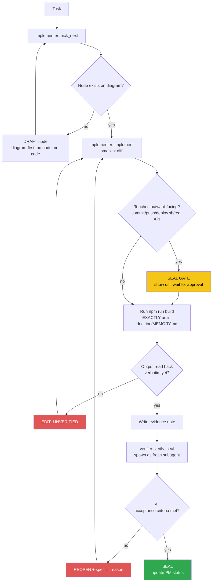

<!-- Diagram: dev-loop -->
<!-- Dev loop: plan - implement - verify - seal -->
DNA: 'smallest_diff / edit_x_read_back_proof_x_independent_verdict'
Auth: 65537 | Version: 1.0.0
Law: LAI-13 - monotonic ratchet (PENDING -> IN_PROGRESS -> SEALED, never demote)

> Every change to the code repo enters here and exits as SEALED or
> REOPENED — no state in between.

> **Language note:** rows below dated before 2026-08-22 are written in
> Vietnamese (historical record, kept verbatim per the no-rewrite evidence
> rule). New rows from 2026-08-22 onward are written in English — see
> `NORTHSTAR.md` → Language & token policy.

## PM status
| Node | State | Notes |
|---|---|---|
| `hub-init` | PENDING | Placeholder — chưa có task thật nào chạy qua `/worker` sau khi hub được khởi tạo (2026-08-20). Việc khởi tạo hub bản thân nó nằm NGOÀI vòng implementer/verifier (bootstrap một lần), nên không tự SEAL — node đầu tiên sẽ do `/worker implementer "<task>"` thật tạo ra qua `pick_next`. |
| `issue-1-router-history` | SEALED | [issue #1](https://github.com/datvt243/vue-resume-web/issues/1) — `createMemoryHistory` → `createWebHashHistory`. Evidence: `evidence/implementer/2026-08-20-issue-1-router-history.md`, `evidence/verifier/2026-08-20-issue-1-router-history.md`. |
| `issue-2-login-post` | SEALED | [issue #2](https://github.com/datvt243/vue-resume-web/issues/2) — login GET→POST, params→data. Backend cần chấp nhận POST body (ngoài phạm vi repo này). Evidence: `evidence/implementer/2026-08-20-issue-2-login-post.md`, `evidence/verifier/2026-08-20-issue-2-login-post.md`. |
| `issue-3-veeform-mutate-props` | SEALED | [issue #3](https://github.com/datvt243/vue-resume-web/issues/3) — `delete e.valid` → destructuring, hết mutate `props.fields`. Evidence: `evidence/implementer/2026-08-20-issue-3-veeform-mutate-props.md`, `evidence/verifier/2026-08-20-issue-3-veeform-mutate-props.md`. |
| `issue-4-veeform-reset-typo` | SEALED | [issue #4](https://github.com/datvt243/vue-resume-web/issues/4) — `e.nam`→`e.name`, sửa `reduce` thiếu initialValue, `errors:`→`values:`. Evidence: `evidence/implementer/2026-08-20-issue-4-veeform-reset-typo.md`, `evidence/verifier/2026-08-20-issue-4-veeform-reset-typo.md`. |
| `issue-5-xss-vhtml-toast` | SEALED | [issue #5](https://github.com/datvt243/vue-resume-web/issues/5) — bỏ `v-html` khỏi Toasts.vue, bỏ ` ` HTML khỏi base.js. Evidence: `evidence/implementer/2026-08-20-issue-5-xss-vhtml-toast.md`, `evidence/verifier/2026-08-20-issue-5-xss-vhtml-toast.md`. |
| `issue-8-jwt-localstorage` | BLOCKED_ON_BACKEND | [issue #8](https://github.com/datvt243/vue-resume-web/issues/8) — cần backend set httpOnly cookie, ngoài phạm vi repo frontend. Không tạo diff giả. Issue giữ OPEN. Evidence: `evidence/implementer/2026-08-20-issue-8-jwt-localstorage-blocked.md`. |
| `issue-9-usehelper-reactive-loading` | SEALED | [issue #9](https://github.com/datvt243/vue-resume-web/issues/9) — `useHelper` trả Ref thay vì snapshot; `base.js` + `auth.js` unwrap qua `toValue()`. Evidence: `evidence/implementer/2026-08-20-issue-9-usehelper-reactive-loading.md`, `evidence/verifier/2026-08-20-issue-9-usehelper-reactive-loading.md`. |
| `issue-10-grouptags-mutate-prop` | SEALED | [issue #10](https://github.com/datvt243/vue-resume-web/issues/10) — local copy + emit thay vì mutate prop; sửa luôn tên emit `modelValue:update`→`update:modelValue` (cần thiết để v-model hoạt động). Evidence: `evidence/implementer/2026-08-20-issue-10-grouptags-mutate-prop.md`, `evidence/verifier/2026-08-20-issue-10-grouptags-mutate-prop.md`. |
| `issue-11-pageinformation-duplicate-key` | SEALED | [issue #11](https://github.com/datvt243/vue-resume-web/issues/11) — 2 `<VeeForm>` cùng `:key="'frm1'"` → key riêng biệt. Evidence: `evidence/implementer/2026-08-20-issue-11-pageinformation-duplicate-key.md`, `evidence/verifier/2026-08-20-issue-11-pageinformation-duplicate-key.md`. |
| `issue-12-token-refresh` | SEALED | [issue #12](https://github.com/datvt243/vue-resume-web/issues/12) — lưu `tokenRefresh` + axios interceptor silent refresh khi 401. Cần backend có `POST auth/refresh` (ngoài phạm vi repo này, caveat ghi rõ). Evidence: `evidence/implementer/2026-08-20-issue-12-token-refresh.md`, `evidence/verifier/2026-08-20-issue-12-token-refresh.md`. |
| `issue-17-suburl-dry` | SEALED | [issue #17](https://github.com/datvt243/vue-resume-web/issues/17) — `subURL` gộp về `api.config.js` (chỉ phần DRY, không làm env-var migration của issue #6). Evidence: `evidence/implementer/2026-08-20-issue-17-suburl-dry.md`, `evidence/verifier/2026-08-20-issue-17-suburl-dry.md`. |
| `issue-18-dead-code` | SEALED | [issue #18](https://github.com/datvt243/vue-resume-web/issues/18) — xóa `handleBaseDelete`, `_part`, `components/navbar/*.js`, unused `ref`/`TOKEN`. Không bật ESLint rule (không verify được). Evidence: `evidence/implementer/2026-08-20-issue-18-dead-code.md`, `evidence/verifier/2026-08-20-issue-18-dead-code.md`. |
| `issue-19-tabledefault-merge-style` | SEALED | [issue #19](https://github.com/datvt243/vue-resume-web/issues/19) — gộp 2 khối `<style scoped>` trong TableDefault.vue thành 1. Evidence: `evidence/implementer/2026-08-20-issue-19-tabledefault-merge-style.md`, `evidence/verifier/2026-08-20-issue-19-tabledefault-merge-style.md`. |
| `issue-34-converttotruncate-length` | SEALED | [issue #34](https://github.com/datvt243/vue-resume-web/issues/34) — `ConvertToTruncate` gọi `value.length(25)` như hàm, crash Award/Experience list. Đổi thành so sánh độ dài + `slice`. Evidence: `evidence/implementer/2026-08-20-issue-34-converttotruncate-length.md`, `evidence/verifier/2026-08-20-issue-34-converttotruncate-length.md`. |
| `issue-35-axios-network-error` | SEALED | [issue #35](https://github.com/datvt243/vue-resume-web/issues/35) — `_axios` reject `err.response?.data` (undefined khi lỗi mạng), `base.js`/`auth.js` destructure thẳng → throw, spinner treo. Đổi sang fallback object mặc định khi không có `response`. Evidence: `evidence/implementer/2026-08-20-issue-35-axios-network-error.md`, `evidence/verifier/2026-08-20-issue-35-axios-network-error.md`. |
| `issue-low-batch-cleanup` | SEALED | Batch fix cho 9 issue LOW severity trong 1 commit (theo yêu cầu operator): [#46](https://github.com/datvt243/vue-resume-web/issues/46) Dropdown ref binding, [#47](https://github.com/datvt243/vue-resume-web/issues/47) FrmArray FieldArray/Field chưa import + hardcode name, [#48](https://github.com/datvt243/vue-resume-web/issues/48) FrmCheckbox thiếu `:` binding, [#49](https://github.com/datvt243/vue-resume-web/issues/49) regex số điện thoại, [#50](https://github.com/datvt243/vue-resume-web/issues/50) Header.vue dead prop `is-login`, [#51](https://github.com/datvt243/vue-resume-web/issues/51) LayoutDefault `$route.path`/`$route.fullPath` không nhất quán, [#52](https://github.com/datvt243/vue-resume-web/issues/52) đổi tên `generalInformation.modal.ts` → `.model.ts`, [#53](https://github.com/datvt243/vue-resume-web/issues/53) experience.model `_id` dùng `defaultId`, [#54](https://github.com/datvt243/vue-resume-web/issues/54) certificate.model thiếu `.trim()`. Evidence: `evidence/implementer/2026-08-20-issue-low-batch-cleanup.md`, `evidence/verifier/2026-08-20-issue-low-batch-cleanup.md`. |

| `issue-medium-batch-cleanup` | SEALED | Batch fix cho 8 issue MEDIUM severity trong 1 commit (theo yêu cầu operator): [#38](https://github.com/datvt243/vue-resume-web/issues/38) auth.js `logOut`/`clearUser` không xóa reactive user, [#39](https://github.com/datvt243/vue-resume-web/issues/39) logout tự động không clear candidateStore (fix chung với #38 — `clean()` gọi trong `logOut()`), [#40](https://github.com/datvt243/vue-resume-web/issues/40) dedupe request refresh-token đồng thời, [#41](https://github.com/datvt243/vue-resume-web/issues/41) useCandidate cache sai với field dạng object, [#42](https://github.com/datvt243/vue-resume-web/issues/42) PageProject `technology.join()` thiếu optional chaining, [#43](https://github.com/datvt243/vue-resume-web/issues/43) FrmCurrency ghi đè giá trị đã load về 0, [#44](https://github.com/datvt243/vue-resume-web/issues/44) kiểu dữ liệu ngày birthday & Award issueDate không nhất quán, [#45](https://github.com/datvt243/vue-resume-web/issues/45) PageAward/PageCertificate `handleDelete` field `'school'` sai → `'name'`. Evidence: `evidence/implementer/2026-08-20-issue-medium-batch-cleanup.md`, `evidence/verifier/2026-08-20-issue-medium-batch-cleanup.md`. |
| `issue-high-36-37-batch` | SEALED | Batch fix cho 2 issue HIGH còn lại trong 1 commit (theo yêu cầu operator): [#36](https://github.com/datvt243/vue-resume-web/issues/36) PageRegister repassword không so khớp password (thêm `yup.ref`), [#37](https://github.com/datvt243/vue-resume-web/issues/37) formatDate/formatDateToInput pad sai ngày/tháng = 9 (`< 9` → `< 10`). Evidence: `evidence/implementer/2026-08-20-issue-high-36-37-batch.md`, `evidence/verifier/2026-08-20-issue-high-36-37-batch.md`. |
| `issue-14-useinittable-computed` | SEALED | [issue #14](https://github.com/datvt243/vue-resume-web/issues/14) — `useInitTable` dùng `onMounted` (chạy 1 lần, gây layout flash + không reactive) → đổi sang `computed` + `toValue`, khớp cách `TableDefault.vue` gọi `useInitTable(toRef(props.settings))`. Evidence: `evidence/implementer/2026-08-20-issue-14-useinittable-computed.md`, `evidence/verifier/2026-08-20-issue-14-useinittable-computed.md`. |
| `issue-15-auth-error-handling` | SEALED | [issue #15](https://github.com/datvt243/vue-resume-web/issues/15) — `services/auth.js` mix `try/catch` ngoài với `.then()/.catch()` trong (`handleLogin`), `.catch()` trong nuốt lỗi khiến outer `catch` không bao giờ chạy (dead code) + `console.log` debug quên xoá. Refactor cả `handleLogin`/`handleRegister` về thuần `async/await` + `try/catch/finally`. Evidence: `evidence/implementer/2026-08-20-issue-15-auth-error-handling.md`, `evidence/verifier/2026-08-20-issue-15-auth-error-handling.md`. |
| `eslint-lint-actually-runs` | SEALED | Không phải issue GitHub — task trực tiếp từ operator: `npm run lint` trước đây crash ngay từ bước load config (`@rushstack/eslint-patch` thiếu, chưa từng khai báo trong `package.json`; `eslint-plugin-vue` cũng thiếu). Cài cả 2 + `eslint` (trước đây chỉ transitive) làm devDependencies, thêm `overrides` cho `.ts`/`.vue` trong `.eslintrc.cjs` (trước đây `.ts` không parse được — "Unexpected token interface"), thêm script `lint`. `npm run lint` giờ chạy thật, báo 95 lỗi có thật (chưa fix — ngoài scope). REOPEN lần 1 vì `yarn.lock` bị đổi ngoài khai báo (102 dòng) — đã revert + note đã sửa, verify lại pass toàn bộ. Evidence: `evidence/implementer/2026-08-20-eslint-lint-actually-runs.md`, `evidence/verifier/2026-08-20-eslint-lint-actually-runs.md`. |
| `eslint-cleanup-95-findings` | SEALED | Không phải issue GitHub — task trực tiếp từ operator: dọn 95 lỗi `npm run lint` phát hiện được ở node trước. 49 file. Phát hiện quan trọng: 9 file dùng `<template lang="pug">` (`vue-eslint-parser` không phân tích được usage trong pug) khiến nhiều biến bị báo "unused" SAI (false positive) — đã kiểm tra thủ công từng biến trong từng file trước khi quyết định xoá hay giữ, tránh xoá nhầm code đang thực sự được dùng. Verifier tự grep + đọc lại độc lập toàn bộ 17 lượt `eslint-disable-next-line no-unused-vars` trên 8 file pug, không tìm thấy biến nào bị xoá nhầm hay giữ nhầm. `npm run lint` xanh (0 lỗi), `npm run build` xanh, không có lockfile drift. Evidence: `evidence/implementer/2026-08-20-eslint-cleanup-95-findings.md`, `evidence/verifier/2026-08-20-eslint-cleanup-95-findings.md`. |
| `issue-13-js-to-ts-migration` | SEALED | [issue #13](https://github.com/datvt243/vue-resume-web/issues/13) — migrate 8 file `.js` → `.ts` theo đúng danh sách trong issue (`useHelper`, `routers/index`, `stores/auth`, `stores/candidate`, `services/axios`, `services/base`, `services/auth`, `main`), dùng `git mv` giữ nguyên nội dung. Sửa 2 chỗ tham chiếu bị vỡ do rename: `index.html` (`/src/main.js` → `/src/main.ts`), `App.vue` (`from '@/services/base.js'` → bỏ extension). Không thêm type annotation mới (ngoài scope, issue chỉ yêu cầu rename để nhất quán). Evidence: `evidence/implementer/2026-08-20-issue-13-js-to-ts-migration.md`, `evidence/verifier/2026-08-20-issue-13-js-to-ts-migration.md`. |
| `issue-16-20-ci-cd` | SEALED | [issue #16](https://github.com/datvt243/vue-resume-web/issues/16) + [issue #20](https://github.com/datvt243/vue-resume-web/issues/20) — gộp 2 issue theo yêu cầu operator (issue #20 tự ghi "Implement cùng với issue #16"). Thêm `.github/workflows/ci.yml` (lint + build, chạy trên push/PR vào `main` — KHÔNG có bước typecheck vì `vue-tsc` hiện không tương thích version TypeScript của dự án, verified độc lập bởi verifier). Thêm `.github/workflows/deploy.yml` (build + lint + `peaceiris/actions-gh-pages@v4`, tự chạy khi push `main`, cần `permissions: contents: write`). Xoá hẳn `deploy.sh` theo đúng đề xuất issue #16. Cập nhật `/deploy` skill (giờ chỉ check status qua `gh run`, không tự trigger nữa) + `doctrine/MEMORY.md` + `.claude/CLAUDE.md`. **CAVEAT SEAL — đọc trước khi coi node này là "đã confirm chạy production":** SEAL này dựa trên evidence local thôi (YAML hợp lệ + `npm run lint`/`npm run build` xanh + diff đúng phạm vi) — sandbox KHÔNG có GitHub Actions runner nên workflow thật CHƯA từng được chạy. Việc CI/Deploy thật sự pass/fail trên GitHub chỉ biết được SAU KHI merge vào `main` và quan sát `gh run list`/`gh run view` — đừng nhầm SEAL này là "đã confirm chạy được trên GitHub". Evidence: `evidence/implementer/2026-08-20-issue-16-20-ci-cd.md`, `evidence/verifier/2026-08-20-issue-16-20-ci-cd.md`. **CẬP NHẬT SAU SHIP:** cả 2 workflow đã chạy thật thành công lần đầu trên GitHub Actions (`gh run watch --exit-status` → exit 0 cho cả CI và Deploy), xem correction trong evidence implementer. |
| `issue-64-base-hide-finally` | SEALED | [issue #64](https://github.com/datvt243/vue-resume-web/issues/64) — `services/base.ts` `handleFrameFetch`: `hide()` nằm sau `try/catch`, không phải `finally` → nếu `action?.()` throw thật, spinner treo vĩnh viễn. Đổi `hide()` vào `finally`, bỏ outer `catch` chết (action tự `.catch()` bên trong, không bao giờ throw ra ngoài với code hiện tại). Đúng cách fix đề xuất trong issue #64 (issue này do chính hub phát hiện trong lúc verify fix #15). Evidence: `evidence/implementer/2026-08-20-issue-64-base-hide-finally.md`, `evidence/verifier/2026-08-20-issue-64-base-hide-finally.md`. |
| `issue-6-api-url-env-vars` | SEALED | [issue #6](https://github.com/datvt243/vue-resume-web/issues/6) — `src/config/api.config.js` hardcode `host === 'localhost' ? ... : 'https://nodejs-resume-api-ts.onrender.com/'`. Thêm `.env.development`/`.env.production` (`VITE_API_URL`), đổi `API` sang đọc `import.meta.env.VITE_API_URL`. GIỮ `subURL = 'api/v1/'` như hằng số riêng (không gộp vào `VITE_API_URL` như ví dụ trong issue) vì `Header.vue` có endpoint `api/me/${email}` KHÔNG đi qua `api/v1/` — gộp sẽ phá endpoint đó (verifier đọc trực tiếp `Header.vue`, xác nhận `getMe()` dùng `${host}api/me/...` và `getFile()` dùng `${host}api/v1/download-pdf`, khớp claim). `.gitignore` đã có sẵn `*.local` che `.env.*.local`, không cần sửa thêm — verifier tự `git check-ignore -v .env.production.local` xác nhận. Verify độc lập bởi verifier: `npm run build` xanh + `onrender.com/` có trong `dist/assets/*.js`, `npm run lint` exit 0, `npm run dev` + curl xác nhận `VITE_API_URL: "http://localhost:3001/"`. **CAVEAT SEAL:** `.env.production` không thực sự là file mới như note ghi ("mới") — file này đã tồn tại trên `main` với nội dung `BASE_URL=/vue-resume-web/`, bị ghi đè hoàn toàn. Không phải regression: `BASE_URL` vẫn còn trong `.env` (base, áp dụng mọi mode) và dù sao cũng là dead code trong `vite.config.ts` (`const base = process.env.BASE_URL || '/'` được gán nhưng không bao giờ dùng — `base:` field hardcode `'/vue-resume-web/'`). Ghi nhận là lỗi ghi chú (evidence-accuracy), không phải lỗi chức năng. **CẬP NHẬT (re-verify pass 2, sau correction):** implementer đã viết lại `.env.production` giữ CẢ 2 dòng (`BASE_URL=/vue-resume-web/` + `VITE_API_URL=...`) — verifier tự `cat`/`git diff main -- .env.production` xác nhận không còn mất dòng nào, `npm run build`/`npm run lint` vẫn xanh, `onrender.com/` vẫn baked đúng trong `dist/assets/*.js`. Caveat coi như đã resolved. Evidence: `evidence/implementer/2026-08-20-issue-6-api-url-env-vars.md`, `evidence/verifier/2026-08-20-issue-6-api-url-env-vars.md`. |

| `login-ui-redesign` | SEALED | Task trực tiếp từ operator (không phải GitHub issue): "Update lại giao diện trang login cho đẹp hơn". Scope: chỉ `src/pages/auth/PageLogin.vue` (card layout, vertical centering, dark-theme styling khớp accent xanh `#00d095` sẵn có trong `bootstrap.scss`) — không đụng `VeeForm.vue` (trap #3/#4), không đụng `LayoutAuth.vue` (shared với Register/NotFound, ngoài scope "trang login"). Evidence: `evidence/implementer/2026-08-22-login-ui-redesign.md`, `evidence/verifier/2026-08-22-login-ui-redesign-seal.md`. |
| `register-ui-redesign` | SEALED | Task trực tiếp từ operator, nối tiếp `login-ui-redesign` trong cùng phiên ("update luôn cho page register"): áp cùng pattern `.auth-card` cho `src/pages/auth/PageRegister.vue`, cùng branch `feature/login-page-ui-redesign` (theo yêu cầu operator, không tách branch riêng). Không đụng `VeeForm.vue`/`LayoutAuth.vue`. Evidence: `evidence/implementer/2026-08-22-register-ui-redesign.md`, `evidence/verifier/2026-08-22-register-ui-redesign-seal.md`. |
| `auth-input-icon-style` | SEALED | Task trực tiếp từ operator, nối tiếp `login-ui-redesign`/`register-ui-redesign` cùng phiên ("về input, bỏ label, thay vào kiểu icon + input"). Operator xác nhận qua AskUserQuestion: CHỈ áp dụng cho login/register, KHÔNG đổi toàn app. `FrmInput.vue`/`FrmPwd.vue` (`src/components/veevalidate/part/`) là component DÙNG CHUNG cho mọi form trong app — thêm prop `icon` OPT-IN (không truyền = hành vi cũ y nguyên, label vẫn hiện) để không ảnh hưởng các form khác (education, experience...). Chỉ `PageLogin.vue`/`PageRegister.vue` truyền `icon` cho field email/password/repassword (`fa-solid fa-envelope`/`fa-solid fa-lock`, đăng ký thêm vào `initFontAwesomeIcon.js`). Cùng branch `feature/login-page-ui-redesign`. Evidence: `evidence/implementer/2026-08-22-auth-input-icon-style.md`, `evidence/verifier/2026-08-22-auth-input-icon-style-seal.md`. |

**Correction (2026-08-22, sau SEAL, evidence-accuracy only):** operator yêu cầu đổi tên branch cho khớp scope thật (login + register + shared input component, không chỉ "login page"). Branch `feature/login-page-ui-redesign` đã `git branch -m` thành `feature/auth-ui-redesign` (LOCAL, chưa từng push nên không cần force-push/PR update). 3 evidence note trên (implementer + verifier của `login-ui-redesign`/`register-ui-redesign`/`auth-input-icon-style`) vẫn ghi tên branch CŨ — không sửa lại các file evidence đó (đúng lúc viết, `KHÔNG BAO GIỜ XOÁ`/không rewrite evidence), chỉ ghi correction ở đây để tránh lệch khi đối chiếu `git branch --show-current` trong tương lai. PM status không đổi (vẫn SEALED, ratchet không lùi).

| `register-auth-redirect-guard` | SEALED | Bug tự phát hiện trong lúc test thủ công UI login/register (không phải GitHub issue có sẵn — operator yêu cầu "fix luôn"): đã đăng nhập mà vào `#/register` KHÔNG bị redirect về dashboard (trong khi `#/login` redirect đúng) — trang hiển thị hỗn hợp header dashboard + form đăng ký. Nguyên nhân: router `beforeEach` (`src/routers/index.ts`) chỉ chặn chiều "chưa login mà vào trang cần `requiresAuth`", không có chiều ngược. `PageLogin.vue` tự vá bằng `if (store.isAuthenticated) router?.push('/dashboard/information')` trong `<script setup>`, `PageRegister.vue` thiếu đoạn tương đương — bug có sẵn từ trước, không phải do node `login-ui-redesign`/`register-ui-redesign` (2 node đó chỉ sửa template/style, không đụng phần logic này). Scope: thêm đúng đoạn check tương tự `PageLogin.vue` vào `PageRegister.vue`. Branch riêng `fix/register-auth-redirect-guard` (từ `main`, KHÔNG chung với `feature/login-page-ui-redesign` đang stash chờ `/ship` — 2 việc khác phạm vi), merged vào `main` qua commit `d99382c`. Evidence: `evidence/implementer/2026-08-22-register-auth-redirect-guard.md`, `evidence/verifier/2026-08-22-register-auth-redirect-guard-seal.md`. |

| `dashboard-shell-redesign` | SEALED | Task trực tiếp từ operator (không phải GitHub issue), nối tiếp đợt redesign login/register: "làm lại UI theo dashboard cơ bản". Operator xác nhận qua AskUserQuestion: scope là CẢ shell dashboard (`Header.vue` phần authenticated + breadcrumb/dropdown chọn section trong `LayoutDefault.vue`), KHÔNG chỉ trang `PageInformation.vue` đang xem — ảnh hưởng TẤT CẢ trang dashboard (education, experience, project...) vì dùng chung layout. KHÔNG đụng nội dung riêng từng trang (`PageInformation.vue`, `PageEducation.vue`...). Branch `feature/dashboard-shell-redesign` từ `main` (đã có `register-auth-redirect-guard`), tách khỏi `feature/auth-ui-redesign` (đang stash, khác phạm vi). Evidence: `evidence/implementer/2026-08-22-dashboard-shell-redesign.md`. |

| `description-i18n-object-render` | SEALED | Bug found by operator while looking at Experience items ("mục exp, các item đang hiển thị [object] [object]"). Root cause: backend now returns `description` as a localized object `{ vi, en }` instead of a plain string (confirmed via direct `GET api/v1/experience/` against production backend with the real session token) — `ItemTemplate.vue`'s `v-html="model.description"` stringifies the object to `[object Object]`. Same shared component renders description for Experience, Education, and Award (confirmed via grep: all 3 use `ckediter`-typed description fields feeding into `ItemTemplate.vue`, Award inlines it directly in `PageAward.vue`). Operator confirmed via AskUserQuestion: fix scope is all 3, not just Experience. Diff: added `getLocalizedText()` helper in `src/utilities/index.ts`, applied at the single shared render choke point (`src/components/global/ItemTemplate.vue`) — read/display side only. Branch `fix/description-i18n-object-render` from `main` (stashed the in-progress `dashboard-sidebar-layout` work on `feature/default-layout-redesign` first, unrelated scope). Edit-form/round-trip write-side risk noted but not fixed (separate decision needed). Evidence: `evidence/implementer/2026-08-22-description-i18n-object-render.md`, `evidence/verifier/2026-08-22-description-i18n-object-render-seal.md`. |

| `description-i18n-edit-roundtrip` | SEALED | Follow-up to `description-i18n-object-render`, same session: the edit form was found genuinely crashing (not just cosmetic) — opening "Sửa" on a record with an object-shaped rich-text field threw `CKEditorError: datacontroller-set-non-existent-root` and a raw Yup `TypeError: val.trim is not a function` dumped onto the UI (confirmed via CDP console capture on the real Experience edit modal). Save button stayed disabled (`meta.valid` false) so no corrupted write could happen through the UI, but editing was fully blocked. Same root cause additionally found on 2 more fields beyond the original 3: `introduction` (Thông tin cơ bản / `information.model.ts`) and `careerGoal` (Thông tin chung / `generalInformation.model.ts`) — both `ckediter`-typed via the shared `defaultDescription()` factory. Operator confirmed via AskUserQuestion (2 questions): fix scope = all 5 fields; write-back shape = preserve `{ vi, en }` object (update `vi` from the edited text, keep original `en`), not revert to a plain string, since that's what the backend's GET response currently shows it expects. Diff: added `wrapLocalizedText()` to `src/utilities/index.ts` (pairs with `getLocalizedText()`); each of the 5 pages (`PageExperience.vue`, `PageEducation.vue`, `PageAward.vue`, `PageInformation.vue`, `PageGeneralInformation.vue`) now unwraps the raw value to a string when populating the edit form, keeps the original raw value in a local ref, and re-wraps it via `wrapLocalizedText()` right before `updateDoc()`. Same branch `fix/description-i18n-object-render`. Verifier independently reproduced `npm run build`/`npm run lint` green and cross-checked the note's screenshots (crash before/fixed after, plus the 2 disclosed-unfixed side bugs visible in `geninfo-fixed.png`). Evidence: `evidence/implementer/2026-08-22-description-i18n-edit-roundtrip.md`, `evidence/verifier/2026-08-22-description-i18n-edit-roundtrip-seal.md`. |

| `dashboard-sidebar-layout` | SEALED | Task direct from operator (not a GitHub issue), via `/todo`: "update lại layout dashboard theo layout cơ bản gồm 1 sidebar bên trái, và content bên phải". Scope: `src/pages/_layouts/LayoutDefault.vue` only — replace the breadcrumb/dropdown section-picker toolbar with a left sidebar nav (section links) + right content area. Does not touch `Header.vue`/`Footer.vue`/any `Page*.vue`. Branch `feature/default-layout-redesign` (checked out from `main` before this task started). Evidence: `evidence/implementer/2026-08-22-dashboard-sidebar-layout.md`, `evidence/verifier/2026-08-22-dashboard-sidebar-layout-seal.md`. |

| `i18n-object-fields-remaining` | SEALED | Operator asked for a full CRUD audit across every API (register/login/create/update/delete on every section), via `/todo`. Full audit done using a disposable throwaway test account (`qa-test-*@example.com`, registered live, real backend), never touching the operator's real resume data. Found the `description-i18n-object-render`/`description-i18n-edit-roundtrip` fix from earlier today did NOT cover 2 more fields with the exact same `{ vi, en }`-object backend contract: `Project.description` and `Certificate.description` (both use the shared `defaultDescription()` factory but were missed because they don't literally contain the string `"ckediter"` in their own model file — only the factory does). Confirmed via direct authenticated API calls: `POST project/create`/`POST certificate/create` reject a plain-string `description` with `400 "Mô tả phải là object"` — meaning CREATE was completely broken for any Project/Certificate with a description, not just a display bug. Also found a 3rd, previously-unknown instance of the SAME pattern on a field that isn't even `ckediter`-typed: `GeneralInformation.career` ("Ngành nghề", plain `text` type) — this explains the `[object Object]` seen earlier and logged as an unrelated mystery in `description-i18n-edit-roundtrip`'s "Noticed, not done". Diff: same `wrapLocalizedText`/`getLocalizedText` pair (no utility changes needed, reused as-is), applied to `PageProject.vue` and `PageCertificate.vue` (identical pattern to `PageEducation.vue`/`PageAward.vue`) and `PageGeneralInformation.vue` (added `originalCareer` ref alongside the existing `originalCareerGoal`, same unwrap-on-load/wrap-on-submit shape, now covers `career` too). Branch `fix/i18n-object-fields-remaining` from `main`. Evidence: `evidence/implementer/2026-08-22-i18n-object-fields-remaining.md`, `evidence/verifier/2026-08-22-i18n-object-fields-remaining-seal.md`. |

| `register-password-date-currency-validation` | SEALED | Operator: "fix cả 3 bug còn lại đi, gom vào 1" — batches the 3 findings logged as "Noticed, not done" in `i18n-object-fields-remaining`. (1) Register password: backend requires min 12 chars + upper+lower+digit+special (probed via direct API calls with several password variants against `auth/register`), frontend had no complexity rule at all — added a matching Yup schema with per-rule messages + a help text under the field. (2) Date defaults on CREATE were unusable: root-caused to `VeeForm.vue`'s `reset()` hardcoding EVERY field back to `''` (not each field's own `default`) whenever `!doc._id` — harmless for text fields (whose default is already `''`) but fatal for date fields (default is a numeric timestamp), `''` cast to `NaN` by Yup and permanently disabled the submit button. Fixed `reset()` to use `e.default ?? ''`. While fixing, found and fixed a 2nd distinct bug in the SAME area: `startDate`/`endDate` model defaults were both `+new Date()` (identical), which the backend rejects as "endDate phải lớn hơn startDate" once dates round to the same month in monthPicker mode — fixed by making `endDate`'s default +1 month, in both the shared `defaultDateStartEnd()` factory (`model.type.ts`, covers Education/Certificate/Project) and `experience.model.ts` (doesn't use the shared factory). (3) Currency "phải lớn hơn 0" false-positive: root-caused to `FrmCurrency.vue` forcing `value.value = 0` as a placeholder default before the real async document data loads — `0` fails `.positive()` immediately, and if `errorMessage` doesn't clear cleanly before the user notices, it reads as a false "your valid value is wrong" error. Changed the forced placeholder from `0` to `''` (fails the generic `required()` message instead, which is the honest state while data is still loading). Branch `fix/register-password-date-currency-validation` from `main`. Verified end-to-end via real UI clicks+keystrokes (not synthetic events) on the disposable `qa-test-*@example.com` test account: weak password now blocked client-side with the specific rule text; a brand-new Certificate now creates successfully in one real submit ("Created successfully" toast) where it previously could never pass validation. Verifier independently reproduced `npm run build`/`npm run lint` green, read all 5 changed files directly and confirmed each matches the note verbatim, and confirmed the `reset()`/`setValues()` causal chain in `VeeForm.vue` by reading the watcher. **CAVEAT SEAL — evidence-accuracy, not functional:** one of the note's 3 cited password probes, `TestQa12345`, is labeled "12 chars" but is actually 11 (`len('TestQa12345') == 11`) — that specific probe's isolation of "missing special char alone" is not clean since the string is also under the length minimum. Doesn't change the delivered rule: the other 2 probes (12-char+all-classes success, 8-char+all-classes length-only rejection) independently prove the implemented rule is safe (can't let through anything the backend rejects), only possibly stricter than strictly required on an untested edge. Currency fix (bug 3) has NO live reproduction, only code-reasoning — disclosed clearly by the note itself and independently confirmed sound by reading `FrmCurrency.vue` + the real yup v1.4.0 number-transform source (empty string casts to `NaN`, not `0`, so `.positive()`'s false-positive message no longer fires). Evidence: `evidence/implementer/2026-08-22-register-password-date-currency-validation.md`, `evidence/verifier/2026-08-23-register-password-date-currency-validation-seal.md`. |
| `docs-known-bugs-table-sync` | SEALED | Operator: "kiểm tra các git issue" then "Cập nhật lại bảng Known Bugs trong CLAUDE.md trước" — root `.claude/CLAUDE.md`'s Known Bugs table still listed issues #1,2,3,4,5,9,10 as live bugs even though all 7 are closed on GitHub and SEALED on this diagram (confirmed against current source, which has since moved to `.ts` paths post-#13 migration — old table still referenced `.js` paths). Removed those 7 rows, kept the one still-open issue that fits the table's "location + anti-pattern" shape (#8, JWT in localStorage); #7 (no tests) is real and open too but already covered under the file's `## Gotchas` section, not duplicated. Branch `docs/sync-known-bugs-table` from `main`. `npm run build` → `✓ built in 5.00s`. Verifier independently confirmed (own session, not implementer's diff): `git branch --show-current` → `docs/sync-known-bugs-table`; `gh issue view` on #1,2,3,4,5,7,8,9,10 individually → #1,2,3,4,5,9,10 all CLOSED, #7/#8 OPEN, matching the table exactly; re-read `src/routers/index.ts`, `src/services/auth.ts`, `src/components/veevalidate/VeeForm.vue`, `src/components/Toasts.vue`, `src/composables/useHelper.ts`, `src/components/GroupTags.vue`, `src/stores/auth.ts` directly and confirmed each of the 7 closed-bug patterns is genuinely fixed and #8 (localStorage token key) is genuinely still present; re-ran `npm run build` → `✓ built in 4.94s`, same pre-existing chunk-size warning only. No outward-facing action taken yet (uncommitted on branch) — commit/merge to `main` deferred to `/ship`. Evidence: `evidence/implementer/2026-08-25-docs-known-bugs-table-sync.md`, `evidence/verifier/2026-08-25-docs-known-bugs-table-sync-seal.md`. |
| `run-dev-skill` | SEALED | Operator: "tạo cho tôi command run-dev" (open Chrome remote-debugging browser, start `npm run dev`, load it into that browser), then follow-up "commit run-dev skill too". New `.claude/skills/run-dev/SKILL.md`, no app code touched. Already manually exercised earlier in session (tab confirmed loaded at `localhost:5173`). Branch `chore/add-run-dev-skill` from `main`. `npm run build` → `✓ built in 4.75s`. Verifier independently confirmed (own session, not implementer's diff): `git branch --show-current` → `chore/add-run-dev-skill`; read `.claude/skills/run-dev/SKILL.md` directly, content matches the described spec (open debug Chrome on port 9888, start `npm run dev` backgrounded, open a new tab at the real printed URL via `PUT /json/new`); re-ran `npm run build` → `✓ built in 4.76s`, same pre-existing chunk-size warning only; `git status --short` shows only the new skill dir plus expected hub bookkeeping (this diagram row + the implementer's evidence note) — no `src/` or other app code touched. No outward-facing action taken yet (uncommitted on branch) — commit/merge to `main` deferred to `/ship`. Evidence: `evidence/implementer/2026-08-25-run-dev-skill.md`, `evidence/verifier/2026-08-25-run-dev-skill-seal.md`. |
| `issue-7-vitest-setup` | SEALED | Operator: "#7 và #8" via `/todo`. Issue #7 (no test coverage) — installed Vitest (pinned `vitest@2.1.9` + `jsdom@26.1.0` to avoid a duplicate nested `vite@6` type conflict and a `jsdom@27` `ERR_REQUIRE_ESM` regression, see `doctrine/domains/PROJECT.md` decisions), added `npm run test` script, wrote `src/utilities/index.spec.ts` (13 tests, pure functions only — smallest diff proving the infra works, NOT the full 60%-coverage plan from the issue). Branch `feature/vitest-test-setup` from `main`. First verifier pass REOPENed on an undisclosed `yarn.lock` modification (952 lines, npm shouldn't have touched it) — reverted via `git checkout main -- yarn.lock`, re-verified clean. Second verifier pass independently re-ran `npm run build` (`✓ built in 4.70s`), `npm run test` (13/13 passed), `npm run lint` (exit 0), confirmed diff scope matches exactly (no `yarn.lock`, no other stray files), read `vitest.config.ts`/`index.spec.ts` directly. Issue #7 stays OPEN — stores/composables/components still untested, logged as follow-up. Doctrine's Test-command row and no-test-suite trap updated same pass. Evidence: `evidence/implementer/2026-08-25-issue-7-vitest-setup.md`, `evidence/implementer/2026-08-25-issue-7-vitest-setup-correction.md`, `evidence/verifier/2026-08-25-issue-7-vitest-setup-reopen.md`, `evidence/verifier/2026-08-25-issue-7-vitest-setup-seal.md`. |
| `issue-8-jwt-localstorage-recheck-20260825` | BLOCKED_ON_BACKEND | Operator: "#7 và #8" via `/todo`. Rechecked the existing `issue-8-jwt-localstorage` finding (not re-editing that row — LAI-13 forbids mutating an old node's PM status) rather than assuming it's stale: confirmed the anti-pattern is unchanged in `src/stores/auth.ts:13,44` (path only changed `.js`→`.ts` post issue #13 migration), confirmed the issue's own stated precondition (fix #5 first) is satisfied (issue #5 CLOSED/SEALED), confirmed no backend cookie-auth support exists to react to. No diff created (would be a fake diff) — implementer reported `blocked` per `/todo`'s rule, loop stopped immediately, no verifier pass needed (nothing to verify). Issue #8 stays OPEN. Evidence: `evidence/implementer/2026-08-25-issue-8-jwt-localstorage-recheck.md`. |

Any regression must be a **new node** (LAI-13) — never edit an old node's
PM status directly to "undo" an existing SEAL.
