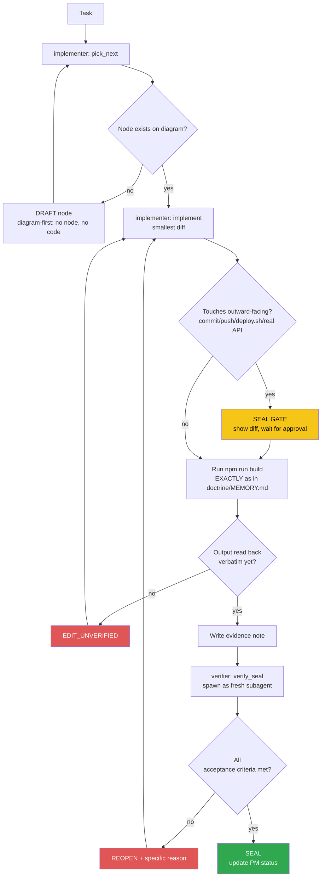

<!-- Diagram: dev-loop -->
<!-- Dev loop: plan - implement - verify - seal -->
DNA: 'smallest_diff / edit_x_read_back_proof_x_independent_verdict'
Auth: 65537 | Version: 1.0.0
Law: LAI-13 - monotonic ratchet (PENDING -> IN_PROGRESS -> SEALED, never demote)

> Every change to the code repo enters here and exits as SEALED or
> REOPENED — no state in between.

> **Language note:** rows below dated before 2026-08-22 are written in
> Vietnamese (historical record, kept verbatim per the no-rewrite evidence
> rule). New rows from 2026-08-22 onward are written in English — see
> `NORTHSTAR.md` → Language & token policy.

## PM status
> Older SEALED nodes (2026-08-20 through 2026-08-25, 41 nodes; then a 2nd
> pass 2026-08-30 covering 7 more nodes dated 2026-08-29; then a 3rd pass
> 2026-09-03 covering every remaining full-content SEALED row, 14 nodes
> dated 2026-08-30 through 2026-09-02) moved to
> `haven/diagrams/dev-loop-archive.md` to keep this file small — every
> worker session reads this file in full. Nothing deleted: the archive
> has each row's full original text verbatim. The compact rows below
> point to it; open the archive only when you need the full story
> behind an old node. `pick_next` only needs non-archived rows. Run
> `/hub-tokens` periodically — if this file flags >15KB again, repeat
> this archiving pass for nodes older than the current work session.
> [note, 3rd pass] after this pass the active file is still ~17.8KB, over
> the 15KB threshold — every remaining SEALED row is now a pointer, the
> only full-content rows left are the 5 non-SEALED nodes (never
> archived per LAI-13/the rule above); further reduction isn't possible
> through archiving alone.

| Node | State | Notes |
|---|---|---|
| `dashboard-visit-list-page` | SEALED | 2026-09-02 — archived, see `haven/diagrams/dev-loop-archive.md`. Evidence: `evidence/implementer/2026-09-02-dashboard-visit-list-page.md`. |
| `dashboard-visit-count-integration` | SEALED | 2026-09-02 — archived, see `haven/diagrams/dev-loop-archive.md`. Evidence: `evidence/implementer/2026-09-02-dashboard-visit-count-integration.md`. |
| `release-skill-branch-cleanup` | SEALED | 2026-09-01 — archived, see `haven/diagrams/dev-loop-archive.md`. Evidence: `evidence/implementer/2026-09-01-release-skill-branch-cleanup.md`. |
| `ci-trigger-staging` | SEALED | 2026-09-01 — archived, see `haven/diagrams/dev-loop-archive.md`. Evidence: `evidence/implementer/2026-09-01-ci-trigger-staging.md`. |
| `docs-readme-issue7-close-sync` | SEALED | 2026-09-01 — archived, see `haven/diagrams/dev-loop-archive.md`. Evidence: `evidence/implementer/2026-09-01-docs-readme-issue7-close-sync.md`. |
| `issue-7-coverage-tooling` | SEALED | 2026-09-01 — archived, see `haven/diagrams/dev-loop-archive.md`. Evidence: `evidence/implementer/2026-09-01-issue-7-coverage-tooling.md`. |
| `issue-7-useinittable-composable-tests` | SEALED | 2026-09-01 — archived, see `haven/diagrams/dev-loop-archive.md`. Evidence: `evidence/implementer/2026-09-01-issue-7-useinittable-composable-tests.md`. |
| `issue-7-usehelper-composable-tests` | SEALED | 2026-09-01 — archived, see `haven/diagrams/dev-loop-archive.md`. Evidence: `evidence/implementer/2026-09-01-issue-7-usehelper-composable-tests.md`. |
| `readme-env-example-cleanup` | SEALED | 2026-08-31 — archived, see `haven/diagrams/dev-loop-archive.md`. Evidence: `evidence/implementer/2026-08-31-readme-env-example-cleanup.md`. |
| `rename-repo-refs-cleanup` | SEALED | 2026-08-31 — archived, see `haven/diagrams/dev-loop-archive.md`. Evidence: `evidence/implementer/2026-08-31-rename-repo-refs-cleanup.md`. |
| `github-pages-base-path-rename` | SEALED | 2026-08-31 — archived, see `haven/diagrams/dev-loop-archive.md`. Evidence: `evidence/implementer/2026-08-31-github-pages-base-path-rename.md`. |
| `agent-hub-token-cleanup-20260830` | SEALED | 2026-08-30 — archived, see `haven/diagrams/dev-loop-archive.md`. Evidence: `evidence/implementer/2026-08-30-agent-hub-token-cleanup.md`. |
| `issue-63-account-settings-page` | SEALED | 2026-09-05 — [issue #63](https://github.com/datvt243/resume-vuejs-website/issues/63) — via `/todo`. Backend claim independently re-verified by the verifier pass (read `resume-nodejs-api` source directly, not just the note): `DELETE /api/v1/candidate` (`fnDelete`/`handlerDelete`) is real and works (self-delete via `req.user._id`, cascades CV sections + uploaded files + project/certificate/award images). `schemaCandidatePatch`/`schemaCandidate` (`src/candidate/candidate.validate.ts`) never declare `email`/`password` fields, and `getObject()` (`src/config/joi.config.ts`) is a bare `Joi.object(fields)` with no `.unknown(true)`, so Joi's default `unknown(false)` rejects any `email`/`password` key sent. `PageAccountSettings.vue` ships a working "delete account" action (real endpoint) + an explicit not-yet-supported note for email/password change (same BLOCKED_ON_BACKEND treatment as `issue-8-jwt-localstorage`, not a fake form). Build/lint/test independently re-run by verifier, matched note exactly. Evidence: `evidence/implementer/2026-09-05-issue-63-account-settings-page.md`, `evidence/verifier/2026-09-05-issue-63-account-settings-page-seal.md`. |
| `issue-61-forgot-reset-password` | SEALED | 2026-09-05 — [issue #61](https://github.com/datvt243/resume-vuejs-website/issues/61) — via `/todo`. Backend investigated directly (`resume-nodejs-api`): `POST /auth/forgot-password` (`{email}` → generic success) and `POST /auth/reset-password` (`{token,password,repassword}`) are real, working endpoints (`schemaForgotPassword`/`schemaResetPassword` in `src/auth/auth.validate.ts`), NOT the same gap as issue-63's candidate-update path. Caveat: `handlerForgotPassword`/`utils/passwordReset.ts` only LOGS the reset link server-side (backend issue #70, no mail provider wired yet) — the endpoint is real, delivery is stubbed; disclosed in the UI and evidence, not hidden. Scope: 2 new pages (forgot/reset password) wired to the real endpoints + a login-page link. "Đổi mật khẩu" while already logged in stays out of scope — no such endpoint exists (already established in `issue-63-account-settings-page`'s evidence: `candidate` update schemas never accept `email`/`password`), `PageAccountSettings.vue` already discloses this, no new BLOCKED node needed for the same already-documented gap. Verifier independently re-checked branch/diff/build/lint/test, the backend endpoints, and the flagged (not-fixed) `App.vue` query-string-drop bug. Evidence: `evidence/implementer/2026-09-05-issue-61-forgot-reset-password.md`, `evidence/verifier/2026-09-05-issue-61-forgot-reset-password-seal.md`. |
| `hub-init` | PENDING | Placeholder — chưa có task thật nào chạy qua `/worker` sau khi hub được khởi tạo (2026-08-20). Việc khởi tạo hub bản thân nó nằm NGOÀI vòng implementer/verifier (bootstrap một lần), nên không tự SEAL — node đầu tiên sẽ do `/worker implementer "<task>"` thật tạo ra qua `pick_next`. |
| `issue-8-jwt-localstorage` | BLOCKED_ON_BACKEND | [issue #8](https://github.com/datvt243/vue-resume-web/issues/8) — cần backend set httpOnly cookie, ngoài phạm vi repo frontend. Không tạo diff giả. Issue giữ OPEN. Evidence: `evidence/implementer/2026-08-20-issue-8-jwt-localstorage-blocked.md`. |
| `loading-countdown-redesign` | SEALED | 2026-08-29 — archived, see `haven/diagrams/dev-loop-archive.md`. Evidence: `evidence/implementer/2026-08-29-loading-countdown-redesign.md`.
| `open-to-work-field` | SEALED | 2026-08-29 — archived, see `haven/diagrams/dev-loop-archive.md`. Evidence: `evidence/implementer/2026-08-29-open-to-work-field.md`.
| `home-dashboard-summary` | SEALED | 2026-08-29 — archived, see `haven/diagrams/dev-loop-archive.md`. Evidence: `evidence/implementer/2026-08-29-home-dashboard-summary.md`.
| `home-dashboard-itviec-style` | SEALED | 2026-08-29 — archived, see `haven/diagrams/dev-loop-archive.md`. Evidence: `evidence/implementer/2026-08-29-home-dashboard-itviec-style.md`.
| `sidebar-welcome-style` | SEALED | 2026-08-29 — archived, see `haven/diagrams/dev-loop-archive.md`. Evidence: `evidence/implementer/2026-08-29-sidebar-welcome-style.md`.
| `sidebar-cv-status-stats` | SEALED | 2026-08-29 — archived, see `haven/diagrams/dev-loop-archive.md`. Evidence: `evidence/implementer/2026-08-29-sidebar-cv-status-stats.md`.
| `sidebar-welcome-merge-stats` | SEALED | 2026-08-29 — archived, see `haven/diagrams/dev-loop-archive.md`. Evidence: `evidence/implementer/2026-08-29-sidebar-welcome-merge-stats.md`.
| `issue-8-jwt-localstorage-recheck-20260825` | BLOCKED_ON_BACKEND | Operator: "#7 và #8" via `/todo`. Rechecked the existing `issue-8-jwt-localstorage` finding (not re-editing that row — LAI-13 forbids mutating an old node's PM status) rather than assuming it's stale: confirmed the anti-pattern is unchanged in `src/stores/auth.ts:13,44` (path only changed `.js`→`.ts` post issue #13 migration), confirmed the issue's own stated precondition (fix #5 first) is satisfied (issue #5 CLOSED/SEALED), confirmed no backend cookie-auth support exists to react to. No diff created (would be a fake diff) — implementer reported `blocked` per `/todo`'s rule, loop stopped immediately, no verifier pass needed (nothing to verify). Issue #8 stays OPEN. Evidence: `evidence/implementer/2026-08-25-issue-8-jwt-localstorage-recheck.md`. |
| `issue-7-veeform-component-tests` | SEALED | 2026-08-30 — archived, see `haven/diagrams/dev-loop-archive.md`. Evidence: `evidence/implementer/2026-08-30-issue-7-veeform-component-tests.md`. |
| `issue-8-jwt-localstorage-recheck-20260830` | BLOCKED_ON_BACKEND | Operator: "#8" via `/todo`. New node per LAI-13 (does not edit the 2 prior rows). Backend (`../backend`) shows real auth-related activity since the last recheck (`refactor(auth): consolidate duplicate v1/v2 auth implementations`, `feat(auth): add email verification`) — worth re-checking, not assumed stale. Found `src/utils/helper-auth.ts:19` now has a `req.cookies[fieldName]` read fallback that didn't exist before, but confirmed it's inert: no `cookie-parser` middleware installed/wired anywhere in the backend (`req.cookies` is never populated, dead code path), and zero `res.cookie`/`httpOnly` calls anywhere in backend `src/` — login still returns the token only in the JSON body. The issue's stated precondition (backend sets `Set-Cookie: token=<jwt>; HttpOnly; Secure; SameSite=Strict`) remains unmet. No diff created (would be a fake diff) — implementer reported `blocked` per `/todo`'s rule, loop stopped immediately, no verifier pass needed. Issue #8 stays OPEN. Evidence: `evidence/implementer/2026-08-30-issue-8-jwt-localstorage-recheck.md`. |
| `issue-8-jwt-localstorage-recheck-20260902` | BLOCKED_ON_BACKEND | Operator: "#8" via `/todo`. New node per LAI-13 (does not edit the 3 prior rows). Backend (`resume-nodejs-api`, renamed from `../backend` since the last recheck) shows real activity since 2026-08-30 (`feat(candidate): add profile visit tracking`, 2 release bumps v1.2.0/v1.2.1, a Visit-schema bugfix, agent-hub/CI chores) — none of it touches auth/cookies, worth re-checking not assumed stale. Re-confirmed byte-for-byte the same blocked state as 2026-08-30: `helper-auth.ts:19`'s `req.cookies[fieldName]` fallback still inert (no `cookie-parser` in `package.json`/`node_modules`), zero `res.cookie`/`httpOnly` anywhere in backend `src/`, `auth.controller.ts` still returns `{ token, tokenRefresh }` in the JSON body only. No diff created (would be a fake diff) — implementer reported `blocked` per `/todo`'s rule, loop stopped immediately, no verifier pass needed. Issue #8 stays OPEN. Evidence: `evidence/implementer/2026-09-02-issue-8-jwt-localstorage-recheck.md`. |
| `issue-55-cv-preview-print` | SEALED | 2026-09-02 — archived, see `haven/diagrams/dev-loop-archive.md`. Evidence: `evidence/implementer/2026-09-02-issue-55-cv-preview-print.md`. |
| `eslint-cleanup-95-findings` | SEALED | 2026-08-20 — archived, see `haven/diagrams/dev-loop-archive.md`. Evidence: `evidence/implementer/2026-08-20-eslint-cleanup-95-findings.md`. |
| `eslint-lint-actually-runs` | SEALED | 2026-08-20 — archived, see `haven/diagrams/dev-loop-archive.md`. Evidence: `evidence/implementer/2026-08-20-eslint-lint-actually-runs.md`. |
| `issue-1-router-history` | SEALED | 2026-08-20 — archived, see `haven/diagrams/dev-loop-archive.md`. Evidence: `evidence/implementer/2026-08-20-issue-1-router-history.md`. |
| `issue-10-grouptags-mutate-prop` | SEALED | 2026-08-20 — archived, see `haven/diagrams/dev-loop-archive.md`. Evidence: `evidence/implementer/2026-08-20-issue-10-grouptags-mutate-prop.md`. |
| `issue-11-pageinformation-duplicate-key` | SEALED | 2026-08-20 — archived, see `haven/diagrams/dev-loop-archive.md`. Evidence: `evidence/implementer/2026-08-20-issue-11-pageinformation-duplicate-key.md`. |
| `issue-12-token-refresh` | SEALED | 2026-08-20 — archived, see `haven/diagrams/dev-loop-archive.md`. Evidence: `evidence/implementer/2026-08-20-issue-12-token-refresh.md`. |
| `issue-13-js-to-ts-migration` | SEALED | 2026-08-20 — archived, see `haven/diagrams/dev-loop-archive.md`. Evidence: `evidence/implementer/2026-08-20-issue-13-js-to-ts-migration.md`. |
| `issue-14-useinittable-computed` | SEALED | 2026-08-20 — archived, see `haven/diagrams/dev-loop-archive.md`. Evidence: `evidence/implementer/2026-08-20-issue-14-useinittable-computed.md`. |
| `issue-15-auth-error-handling` | SEALED | 2026-08-20 — archived, see `haven/diagrams/dev-loop-archive.md`. Evidence: `evidence/implementer/2026-08-20-issue-15-auth-error-handling.md`. |
| `issue-16-20-ci-cd` | SEALED | 2026-08-20 — archived, see `haven/diagrams/dev-loop-archive.md`. Evidence: `evidence/implementer/2026-08-20-issue-16-20-ci-cd.md`. |
| `issue-17-suburl-dry` | SEALED | 2026-08-20 — archived, see `haven/diagrams/dev-loop-archive.md`. Evidence: `evidence/implementer/2026-08-20-issue-17-suburl-dry.md`. |
| `issue-18-dead-code` | SEALED | 2026-08-20 — archived, see `haven/diagrams/dev-loop-archive.md`. Evidence: `evidence/implementer/2026-08-20-issue-18-dead-code.md`. |
| `issue-19-tabledefault-merge-style` | SEALED | 2026-08-20 — archived, see `haven/diagrams/dev-loop-archive.md`. Evidence: `evidence/implementer/2026-08-20-issue-19-tabledefault-merge-style.md`. |
| `issue-2-login-post` | SEALED | 2026-08-20 — archived, see `haven/diagrams/dev-loop-archive.md`. Evidence: `evidence/implementer/2026-08-20-issue-2-login-post.md`. |
| `issue-3-veeform-mutate-props` | SEALED | 2026-08-20 — archived, see `haven/diagrams/dev-loop-archive.md`. Evidence: `evidence/implementer/2026-08-20-issue-3-veeform-mutate-props.md`. |
| `issue-34-converttotruncate-length` | SEALED | 2026-08-20 — archived, see `haven/diagrams/dev-loop-archive.md`. Evidence: `evidence/implementer/2026-08-20-issue-34-converttotruncate-length.md`. |
| `issue-35-axios-network-error` | SEALED | 2026-08-20 — archived, see `haven/diagrams/dev-loop-archive.md`. Evidence: `evidence/implementer/2026-08-20-issue-35-axios-network-error.md`. |
| `issue-4-veeform-reset-typo` | SEALED | 2026-08-20 — archived, see `haven/diagrams/dev-loop-archive.md`. Evidence: `evidence/implementer/2026-08-20-issue-4-veeform-reset-typo.md`. |
| `issue-5-xss-vhtml-toast` | SEALED | 2026-08-20 — archived, see `haven/diagrams/dev-loop-archive.md`. Evidence: `evidence/implementer/2026-08-20-issue-5-xss-vhtml-toast.md`. |
| `issue-6-api-url-env-vars` | SEALED | 2026-08-20 — archived, see `haven/diagrams/dev-loop-archive.md`. Evidence: `evidence/implementer/2026-08-20-issue-6-api-url-env-vars.md`. |
| `issue-64-base-hide-finally` | SEALED | 2026-08-20 — archived, see `haven/diagrams/dev-loop-archive.md`. Evidence: `evidence/implementer/2026-08-20-issue-64-base-hide-finally.md`. |
| `issue-9-usehelper-reactive-loading` | SEALED | 2026-08-20 — archived, see `haven/diagrams/dev-loop-archive.md`. Evidence: `evidence/implementer/2026-08-20-issue-9-usehelper-reactive-loading.md`. |
| `issue-high-36-37-batch` | SEALED | 2026-08-20 — archived, see `haven/diagrams/dev-loop-archive.md`. Evidence: `evidence/implementer/2026-08-20-issue-high-36-37-batch.md`. |
| `issue-low-batch-cleanup` | SEALED | 2026-08-20 — archived, see `haven/diagrams/dev-loop-archive.md`. Evidence: `evidence/implementer/2026-08-20-issue-low-batch-cleanup.md`. |
| `issue-medium-batch-cleanup` | SEALED | 2026-08-20 — archived, see `haven/diagrams/dev-loop-archive.md`. Evidence: `evidence/implementer/2026-08-20-issue-medium-batch-cleanup.md`. |
| `auth-input-icon-style` | SEALED | 2026-08-22 — archived, see `haven/diagrams/dev-loop-archive.md`. Evidence: `evidence/implementer/2026-08-22-auth-input-icon-style.md`. |
| `dashboard-shell-redesign` | SEALED | 2026-08-22 — archived, see `haven/diagrams/dev-loop-archive.md`. Evidence: `evidence/implementer/2026-08-22-dashboard-shell-redesign.md`. |
| `dashboard-sidebar-layout` | SEALED | 2026-08-22 — archived, see `haven/diagrams/dev-loop-archive.md`. Evidence: `evidence/implementer/2026-08-22-dashboard-sidebar-layout.md`. |
| `description-i18n-edit-roundtrip` | SEALED | 2026-08-22 — archived, see `haven/diagrams/dev-loop-archive.md`. Evidence: `evidence/implementer/2026-08-22-description-i18n-edit-roundtrip.md`. |
| `description-i18n-object-render` | SEALED | 2026-08-22 — archived, see `haven/diagrams/dev-loop-archive.md`. Evidence: `evidence/implementer/2026-08-22-description-i18n-object-render.md`. |
| `i18n-object-fields-remaining` | SEALED | 2026-08-22 — archived, see `haven/diagrams/dev-loop-archive.md`. Evidence: `evidence/implementer/2026-08-22-i18n-object-fields-remaining.md`. |
| `login-ui-redesign` | SEALED | 2026-08-22 — archived, see `haven/diagrams/dev-loop-archive.md`. Evidence: `evidence/implementer/2026-08-22-login-ui-redesign.md`. |
| `register-auth-redirect-guard` | SEALED | 2026-08-22 — archived, see `haven/diagrams/dev-loop-archive.md`. Evidence: `evidence/implementer/2026-08-22-register-auth-redirect-guard.md`. |
| `register-password-date-currency-validation` | SEALED | 2026-08-22 — archived, see `haven/diagrams/dev-loop-archive.md`. Evidence: `evidence/implementer/2026-08-22-register-password-date-currency-validation.md`. |
| `register-ui-redesign` | SEALED | 2026-08-22 — archived, see `haven/diagrams/dev-loop-archive.md`. Evidence: `evidence/implementer/2026-08-22-register-ui-redesign.md`. |
| `docs-known-bugs-table-sync` | SEALED | 2026-08-25 — archived, see `haven/diagrams/dev-loop-archive.md`. Evidence: `evidence/implementer/2026-08-25-docs-known-bugs-table-sync.md`. |
| `issue-62-dark-mode-body-attr-override` | SEALED | 2026-08-25 — archived, see `haven/diagrams/dev-loop-archive.md`. Evidence: `evidence/implementer/2026-08-25-issue-62-dark-mode-body-attr-override.md`. |
| `issue-62-dark-mode-toggle` | SEALED | 2026-08-25 — archived, see `haven/diagrams/dev-loop-archive.md`. Evidence: `evidence/implementer/2026-08-25-issue-62-dark-mode-toggle.md`. |
| `issue-7-stores-composables-tests` | SEALED | 2026-08-25 — archived, see `haven/diagrams/dev-loop-archive.md`. Evidence: `evidence/implementer/2026-08-25-issue-7-stores-composables-tests.md`. |
| `issue-7-vitest-setup` | SEALED | 2026-08-25 — archived, see `haven/diagrams/dev-loop-archive.md`. Evidence: `evidence/implementer/2026-08-25-issue-7-vitest-setup.md`. |
| `run-dev-skill` | SEALED | 2026-08-25 — archived, see `haven/diagrams/dev-loop-archive.md`. Evidence: `evidence/implementer/2026-08-25-run-dev-skill.md`. |

Any regression must be a **new node** (LAI-13) — never edit an old node's
PM status directly to "undo" an existing SEAL.
