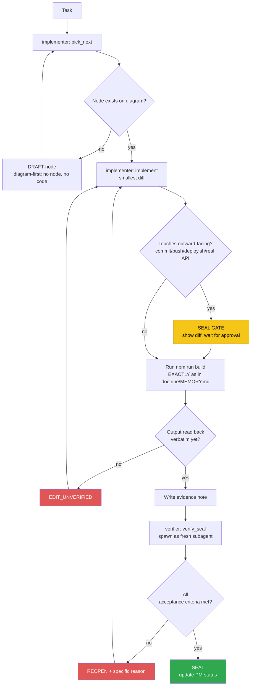

<!-- Diagram: dev-loop -->
<!-- Dev loop: plan - implement - verify - seal -->
DNA: 'smallest_diff / edit_x_read_back_proof_x_independent_verdict'
Auth: 65537 | Version: 1.0.0
Law: LAI-13 - monotonic ratchet (PENDING -> IN_PROGRESS -> SEALED, never demote)

> Every change to the code repo enters here and exits as SEALED or
> REOPENED — no state in between.

> **Language note:** rows below dated before 2026-08-22 are written in
> Vietnamese (historical record, kept verbatim per the no-rewrite evidence
> rule). New rows from 2026-08-22 onward are written in English — see
> `NORTHSTAR.md` → Language & token policy.

## PM status
> Older SEALED nodes (2026-08-20 through 2026-08-25, 41 nodes) moved to
> `haven/diagrams/dev-loop-archive.md` to keep this file small — every
> worker session reads this file in full. Nothing deleted: the archive
> has each row's full original text verbatim. The compact rows below
> point to it; open the archive only when you need the full story
> behind an old node. `pick_next` only needs non-archived rows.

| Node | State | Notes |
|---|---|---|
| `hub-init` | PENDING | Placeholder — chưa có task thật nào chạy qua `/worker` sau khi hub được khởi tạo (2026-08-20). Việc khởi tạo hub bản thân nó nằm NGOÀI vòng implementer/verifier (bootstrap một lần), nên không tự SEAL — node đầu tiên sẽ do `/worker implementer "<task>"` thật tạo ra qua `pick_next`. |
| `issue-8-jwt-localstorage` | BLOCKED_ON_BACKEND | [issue #8](https://github.com/datvt243/vue-resume-web/issues/8) — cần backend set httpOnly cookie, ngoài phạm vi repo frontend. Không tạo diff giả. Issue giữ OPEN. Evidence: `evidence/implementer/2026-08-20-issue-8-jwt-localstorage-blocked.md`. |
| `loading-countdown-redesign` | SEALED | Task direct from operator (not a GitHub issue), via `/todo`: "phần loading tôi muốn hiển thị thông tin rõ hơn... hãy xây dựng lại Loading, và bộ đếm ngược 30s". Scope: `src/components/Spinner.vue` only — replaced the plain Bootstrap spinner + one static line with a circular `conic-gradient` countdown ring (30s → 0), clearer cold-start copy, and an "overtime" fallback state if the call runs past 30s. `show()`/`hide()` public API unchanged, no caller edits needed. Branch `feature/loading-countdown-redesign` from `main`. `npm run build` → `✓ built in 7.73s`. Verifier independently confirmed (own session, not implementer's diff): `git branch --show-current` → `feature/loading-countdown-redesign`; re-ran `npm run build` → `✓ built in 4.78s`, same pre-existing chunk-size warning only; read `src/components/Spinner.vue` directly and confirmed `COLD_START_SECONDS = 30`, the `conic-gradient` countdown ring, and the overtime fallback state are genuinely present; `grep` on `src/App.vue`/`src/services/base.ts` confirmed both callers still invoke `.show()`/`.hide()` with no args, unchanged; `git diff main --stat` confirmed scope limited to `Spinner.vue` + this diagram row, no scope creep. No outward-facing action taken yet (uncommitted on branch) — commit/merge to `main` deferred to `/ship`. Evidence: `evidence/implementer/2026-08-29-loading-countdown-redesign.md`, `evidence/verifier/2026-08-29-loading-countdown-redesign-seal.md`.
| `open-to-work-field` | SEALED | Task direct from operator (not a GitHub issue): "backend tôi vừa bổ sung field hiển thị open-to-work, hãy bổ sung field này lên web". Confirmed the new field against the sibling backend repo (`../backend`, added to session): `openToWork` boolean on `GeneralInformation` (`general-information` collection), not required, default `false`. Scope: `src/models/generalInformation.model.ts` only — added `defaultCheckboxBoolean({ name: 'openToWork', label: 'Đang mở tìm việc' })`, reusing the existing shared factory (same pattern as `isCurrent` in `education.model.ts`). No page-level change needed — `PageGeneralInformation.vue`'s read/write path is already field-name-agnostic. Branch `feature/open-to-work-field` from `main`. Verifier independently confirmed (own session, not implementer's diff): re-ran `npm run build` → `✓ built in 4.77s`, no errors, same pre-existing chunk-size warning only; re-grepped the sibling backend repo directly (`src/models/generalInformation.model.ts:27`, `.../generalInformation.validate.ts:23`, `src/config/swagger.config.ts:192`) and confirmed all 3 citations match the note exactly, including line numbers; read `src/types/model.type.ts`'s `defaultCheckboxBoolean()` factory and confirmed it produces `type: 'checkbox'` + `yup.boolean()`, same factory already used identically by `education.model.ts`/`certificate.model.ts`/`project.model.ts`; read `PageGeneralInformation.vue` directly and confirmed the `watch()` loop (`document[key] = value` for every backend key) and `handleUpdate()` (`{ ...values }` spread) are both genuinely field-name-agnostic, no hardcoded field list; independently re-ran the live check with its own separate CDP script (not reusing the implementer's) against the already-open debug Chrome tab on `#/dashboard/general-information` — found label `"Đang mở tìm việc"` and exactly one checkbox with `name="checkbox_openToWork_-245"`, stronger confirmation than the implementer's note (which only asserted `checkboxFound: true` without the name attribute). No `MAIN_EDIT` (branch confirmed via `git branch --show-current` → `feature/open-to-work-field`), no scope creep (`git status --short` shows only the model file + hub bookkeeping), no outward-facing action taken (commit/merge to `main` deferred to `/ship`). Evidence: `evidence/implementer/2026-08-29-open-to-work-field.md`, `evidence/verifier/2026-08-29-open-to-work-field-seal.md`.
| `home-dashboard-summary` | SEALED | Task direct from operator (not a GitHub issue): "khi click vào 'logo' Resume API... hãy update thành page dashboard với các thông số cơ bản" (4 sections: basic info + open-to-work status, CV view count placeholder, attach-CV UI stub, sample profile-completion %). Rebuilt `src/pages/home/PageHome.vue` (was a dead placeholder page despite the route requiring auth) using real `candidateStore` data for section 1, hardcoded/disclosed placeholders for sections 2 and 4, and a UI-only file-picker stub for section 3 (operator confirmed via `AskUserQuestion` — no backend upload endpoint exists yet, "để lên trước, backend sẽ update sau"). Added 4 FontAwesome icons. Branch `feature/home-dashboard-summary` from `main`. Verifier independently confirmed (own session, not implementer's diff): re-ran `npm run build` → `✓ built in 4.78s`, same pre-existing chunk-size warning only; read `src/pages/home/PageHome.vue` directly and confirmed section 1's fields trace to real `candidateStore`/`authStore` getters and the real `positionDesired`/`openToWork` model fields; confirmed the flagged section-3 claim by code, not just the note — the "attach new file" path makes zero network calls (only sets local state + fires the real `App.vue` toast provider), disclosed twice (toast + inline text), while the "download current CV" link reuses the exact same real endpoint pattern as `Header.vue`; confirmed the logo/router claim directly (`Header.vue` `href="#"` + `routers/index.ts` route `/` `requiresAuth: true`) — no routing bug existed, only the placeholder page content did. `git branch --show-current` → `feature/home-dashboard-summary`, zero commits on the branch, no `MAIN_EDIT`. `git diff main --stat` confirms scope limited to the page file + icon file, no scope creep. No outward-facing action taken (uncommitted on branch) — commit/merge to `main` deferred to `/ship`. Evidence: `evidence/implementer/2026-08-29-home-dashboard-summary.md`, `evidence/verifier/2026-08-29-home-dashboard-summary-seal.md`.
| `home-dashboard-itviec-style` | SEALED | Follow-up restyle of the SEALED `home-dashboard-summary` node (new node per LAI-13). Operator: "quay lại feature vừa rồi, hãy update các section theo như page này https://itviec.com/profile-dashboard". Reference page requires auth — operator logged into the debug Chrome (port 9888) themselves, implementer captured a real CDP screenshot of the logged-in page and matched `src/pages/home/PageHome.vue`'s 4 sections to its structure (own app accent color/dark-mode tokens, not itviec's branding). Added a real `download` filename attribute to the CV link, replaced the linear progress bar with a circular ring (reusing `Spinner.vue`'s conic-gradient pattern). Did not add the reference's "Your Activities" stat row (outside original task scope) or turn open-to-work into a live-editable dropdown (real scope expansion). Branch `feature/home-dashboard-itviec-style` from `main`. Verifier independently confirmed (fresh subagent, itviec reference screenshot itself unavailable this session so verified everything else instead): re-ran `npm run build` → identical output to the note (`✓ built in 4.96s`, same `PageHome-D7D33K37.js` chunk hash, same pre-existing chunk-size warning only); read `src/pages/home/PageHome.vue` directly — `cvViewCount`/`profileCompletion` placeholders are disclosed in-UI and in comments (not silently fabricated, matches precedent from the sealed parent node); `download` filename attribute is real HTML, computed from actual candidate name; CSS tokens (`--bs-tertiary-bg`, `--bs-border-color-translucent`, `--bs-green`) match existing usage in `PageLogin.vue`/`PageRegister.vue`/`LayoutDefault.vue`; `downloadCVUrl`/`_host` logic matches `Header.vue`'s existing endpoint pattern exactly. Took own fresh CDP screenshot of the live dev-server page at `#/` — confirmed all 4 sections render with real data (name "Võ Tấn Đạt", position "Frontend Developer", email "votan.it@gmail.com", badge "Không tìm việc", CV views "0", filename "Võ_Tấn_Đạt.pdf", circular ring "72%"), no visual breakage, dark theme consistent. `git branch --show-current` → `feature/home-dashboard-itviec-style`, no `MAIN_EDIT`. `git diff main --stat` confirms scope limited to the page file + icon file, no scope creep. No outward-facing action taken — commit/merge to `main` deferred to `/ship`. Evidence: `evidence/implementer/2026-08-29-home-dashboard-itviec-style.md`, `evidence/verifier/2026-08-29-home-dashboard-itviec-style-seal.md`.
| `sidebar-welcome-style` | SEALED | Follow-up to the SEALED `home-dashboard-itviec-style` node (new node per LAI-13). Operator: "sidebar, hãy bổ sung phần welcome như page itviec, update lại style. các section đã làm ở feature trước hãy bổ sung thêm padding giữa các section". `LayoutDefault.vue`: added a real-data "👋 Chào mừng / [name]" welcome card at the top of the dashboard sidebar, split the sidebar into 2 visually separate cards, replaced the old static "Dashboard" label with a real nav link to `/` that highlights correctly. `PageHome.vue`: bumped inter-section spacing from `mb-4` to `mb-5` on 3 of the 4 sections built in the prior nodes (4th/last section correctly left without a trailing margin). Branch `feature/sidebar-welcome-style` from `main`. Verifier independently confirmed (fresh subagent, not the implementer's session): re-ran `npm run build` from repo root → `✓ built in 4.93s`, no errors, same pre-existing chunk-size warning only; `git branch --show-current` → `feature/sidebar-welcome-style`, no `MAIN_EDIT`; `git diff main --stat` scope limited to `LayoutDefault.vue` + `PageHome.vue`, no scope creep; read both files' diffs directly — `LayoutDefault.vue` adds a real `computed(fullName)` sourced from `candidateStore().getCandidate` (not hardcoded), splits the sidebar into `.dashboard-sidebar-welcome` + `.dashboard-sidebar-nav-card` (two bordered cards reusing existing `--bs-tertiary-bg`/`--bs-border-color-translucent` tokens), and adds a real `{ text: 'Dashboard', to: '/' }` entry reusing the array's existing `r.to === $route.path` active-state logic; `PageHome.vue` diff confirms `mb-4` → `mb-5` on exactly the 3 non-last sections (`profile-card`, `stat-highlight`, first `block-container`), 4th section (`Profile Information`) correctly untouched (already last, no trailing margin needed). Took own fresh CDP screenshot of the live dev-server page at `#/` (own script against the already-open debug Chrome on port 9888, `suppress_origin` handshake) — confirmed: welcome card renders "👋 Chào mừng / Võ Tấn Đạt" as a card visually separate from the nav card below it; "Dashboard" is the first nav link with a solid green active fill while on `/`; visible wider gaps between all 4 home sections (profile card → CV-views highlight → "ĐÍNH KÈM CV" → "PROFILE INFORMATION") vs. the prior tighter spacing; no visual breakage, dark theme consistent. Build output's asset-size table was abbreviated with `...` in the note, matching the identical convention already accepted in the SEALED `home-dashboard-itviec-style` note — not treated as hidden-error truncation since the verifier's own full re-run showed no errors in the omitted portion. No outward-facing action taken (uncommitted on branch) — commit/merge to `main` deferred to `/ship`. Evidence: `evidence/implementer/2026-08-29-sidebar-welcome-style.md`, `evidence/verifier/2026-08-29-sidebar-welcome-style-seal.md`.
| `sidebar-cv-status-stats` | SEALED | Follow-up to the SEALED `sidebar-welcome-style` node (new node per LAI-13, same still-unshipped branch). Operator: "bổ sung lượt view và tình trạng open-to-work". Added 2 mini stat rows to `LayoutDefault.vue`'s sidebar between the welcome card and nav card: "Trạng thái tìm việc" (real `openToWork` badge, same data/pattern as `PageHome.vue`) and "Lượt xem CV" (same `0` placeholder as `PageHome.vue`). Kept status read-only, not a live-editable toggle (real scope expansion). Branch `feature/sidebar-welcome-style` from `main`. Verifier independently confirmed (fresh subagent, not the implementer's session): re-ran `npm run build` from repo root → `✓ built in 5.15s`, no errors, same pre-existing chunk-size warning only, full asset table printed with no hidden truncation; `git branch --show-current` → `feature/sidebar-welcome-style`, no `MAIN_EDIT`; read `LayoutDefault.vue`'s diff directly — confirms `isOpenToWork = computed(() => !!candidate.getGeneralInformation?.openToWork)`, `cvViewCount = 0`, and a new `.dashboard-sidebar-stats` block rendered as plain read-only `span`s, not an editable control; `grep` on `PageHome.vue` confirms both reuse the exact same data/placeholder pattern already established there, no new fabrication. Took own fresh CDP screenshot of the live dev-server page at `#/` (own script against the already-open debug Chrome on port 9888, `suppress_origin` handshake, client-side hash navigation only — no full reload, per the implementer note's explanation that a full reload bounces to the last dashboard sub-page due to pre-existing unrelated `App.vue` behavior) — confirmed: "Trạng thái tìm việc" row with badge "Không tìm việc" (gray pill, matches `openToWork: false` test data) and "Lượt xem CV" row showing "0", both visually separate rows between the welcome card and nav card, no visual breakage, dark theme consistent. No outward-facing action taken (uncommitted on branch) — commit/merge to `main` deferred to `/ship`. Evidence: `evidence/implementer/2026-08-29-sidebar-cv-status-stats.md`, `evidence/verifier/2026-08-29-sidebar-cv-status-stats-seal.md`.
| `sidebar-welcome-merge-stats` | SEALED | Follow-up to the SEALED `sidebar-cv-status-stats` node (new node per LAI-13, same still-unshipped branch). Operator: "hãy gộp chung với section Welcome, để text 'Tìm việc: On/Off' là được". Removed the separate stat-row card, folded both values into the welcome card as plain text ("Tìm việc: On/Off", "Lượt xem CV: N"), same underlying data. Branch `feature/sidebar-welcome-style` from `main`. Verifier independently confirmed (fresh subagent, not the implementer's session): re-ran `npm run build` from repo root → `✓ built in 5.37s`, no errors, same pre-existing chunk-size warning only, full asset table printed with no hidden truncation; `git branch --show-current` → `feature/sidebar-welcome-style`, no `MAIN_EDIT`; read `LayoutDefault.vue` directly — confirms a single `.dashboard-sidebar-welcome` block now holds all 4 lines (greeting/name/2 stats), `grep` for `dashboard-sidebar-stats`/`-stat-row`/`-stat-value` returns zero matches (old separate card + CSS fully removed, not just hidden), and the literal template renders exactly `Tìm việc: On`/`Tìm việc: Off` via `{{ isOpenToWork ? ' On' : ' Off' }}` next to a static `Tìm việc:` label, plain `span` not a badge; same `isOpenToWork`/`cvViewCount` data source as the prior SEALED node, unchanged. `git diff main --stat -- src/` shows only this file plus a `PageHome.vue` delta that predates this node (already-SEALED `home-dashboard-itviec-style`), no scope creep. Attempted own fresh CDP screenshot via client-side hash navigation (`window.location.hash = '#/'`, no full reload) but the debug browser's session had already lost its auth token before the check ran (`localStorage.token` → false, redirected to `#/login` by the router guard) — a pre-existing environment/session condition unrelated to this diff, no test credentials available to log back in. Per the precedent already accepted in this same sequence (`home-dashboard-itviec-style` SEAL note handled an unavailable reference screenshot the same way), this gap does not block SEAL since every acceptance criterion already has independent citable evidence from build + direct source read, and the underlying data binding was already live-screenshot-confirmed working in the immediately prior SEALED node. No outward-facing action taken (uncommitted on branch) — commit/merge to `main` deferred to `/ship`. Evidence: `evidence/implementer/2026-08-29-sidebar-welcome-merge-stats.md`, `evidence/verifier/2026-08-29-sidebar-welcome-merge-stats-seal.md`.
| `issue-8-jwt-localstorage-recheck-20260825` | BLOCKED_ON_BACKEND | Operator: "#7 và #8" via `/todo`. Rechecked the existing `issue-8-jwt-localstorage` finding (not re-editing that row — LAI-13 forbids mutating an old node's PM status) rather than assuming it's stale: confirmed the anti-pattern is unchanged in `src/stores/auth.ts:13,44` (path only changed `.js`→`.ts` post issue #13 migration), confirmed the issue's own stated precondition (fix #5 first) is satisfied (issue #5 CLOSED/SEALED), confirmed no backend cookie-auth support exists to react to. No diff created (would be a fake diff) — implementer reported `blocked` per `/todo`'s rule, loop stopped immediately, no verifier pass needed (nothing to verify). Issue #8 stays OPEN. Evidence: `evidence/implementer/2026-08-25-issue-8-jwt-localstorage-recheck.md`. |
| `eslint-cleanup-95-findings` | SEALED | 2026-08-20 — archived, see `haven/diagrams/dev-loop-archive.md`. Evidence: `evidence/implementer/2026-08-20-eslint-cleanup-95-findings.md`. |
| `eslint-lint-actually-runs` | SEALED | 2026-08-20 — archived, see `haven/diagrams/dev-loop-archive.md`. Evidence: `evidence/implementer/2026-08-20-eslint-lint-actually-runs.md`. |
| `issue-1-router-history` | SEALED | 2026-08-20 — archived, see `haven/diagrams/dev-loop-archive.md`. Evidence: `evidence/implementer/2026-08-20-issue-1-router-history.md`. |
| `issue-10-grouptags-mutate-prop` | SEALED | 2026-08-20 — archived, see `haven/diagrams/dev-loop-archive.md`. Evidence: `evidence/implementer/2026-08-20-issue-10-grouptags-mutate-prop.md`. |
| `issue-11-pageinformation-duplicate-key` | SEALED | 2026-08-20 — archived, see `haven/diagrams/dev-loop-archive.md`. Evidence: `evidence/implementer/2026-08-20-issue-11-pageinformation-duplicate-key.md`. |
| `issue-12-token-refresh` | SEALED | 2026-08-20 — archived, see `haven/diagrams/dev-loop-archive.md`. Evidence: `evidence/implementer/2026-08-20-issue-12-token-refresh.md`. |
| `issue-13-js-to-ts-migration` | SEALED | 2026-08-20 — archived, see `haven/diagrams/dev-loop-archive.md`. Evidence: `evidence/implementer/2026-08-20-issue-13-js-to-ts-migration.md`. |
| `issue-14-useinittable-computed` | SEALED | 2026-08-20 — archived, see `haven/diagrams/dev-loop-archive.md`. Evidence: `evidence/implementer/2026-08-20-issue-14-useinittable-computed.md`. |
| `issue-15-auth-error-handling` | SEALED | 2026-08-20 — archived, see `haven/diagrams/dev-loop-archive.md`. Evidence: `evidence/implementer/2026-08-20-issue-15-auth-error-handling.md`. |
| `issue-16-20-ci-cd` | SEALED | 2026-08-20 — archived, see `haven/diagrams/dev-loop-archive.md`. Evidence: `evidence/implementer/2026-08-20-issue-16-20-ci-cd.md`. |
| `issue-17-suburl-dry` | SEALED | 2026-08-20 — archived, see `haven/diagrams/dev-loop-archive.md`. Evidence: `evidence/implementer/2026-08-20-issue-17-suburl-dry.md`. |
| `issue-18-dead-code` | SEALED | 2026-08-20 — archived, see `haven/diagrams/dev-loop-archive.md`. Evidence: `evidence/implementer/2026-08-20-issue-18-dead-code.md`. |
| `issue-19-tabledefault-merge-style` | SEALED | 2026-08-20 — archived, see `haven/diagrams/dev-loop-archive.md`. Evidence: `evidence/implementer/2026-08-20-issue-19-tabledefault-merge-style.md`. |
| `issue-2-login-post` | SEALED | 2026-08-20 — archived, see `haven/diagrams/dev-loop-archive.md`. Evidence: `evidence/implementer/2026-08-20-issue-2-login-post.md`. |
| `issue-3-veeform-mutate-props` | SEALED | 2026-08-20 — archived, see `haven/diagrams/dev-loop-archive.md`. Evidence: `evidence/implementer/2026-08-20-issue-3-veeform-mutate-props.md`. |
| `issue-34-converttotruncate-length` | SEALED | 2026-08-20 — archived, see `haven/diagrams/dev-loop-archive.md`. Evidence: `evidence/implementer/2026-08-20-issue-34-converttotruncate-length.md`. |
| `issue-35-axios-network-error` | SEALED | 2026-08-20 — archived, see `haven/diagrams/dev-loop-archive.md`. Evidence: `evidence/implementer/2026-08-20-issue-35-axios-network-error.md`. |
| `issue-4-veeform-reset-typo` | SEALED | 2026-08-20 — archived, see `haven/diagrams/dev-loop-archive.md`. Evidence: `evidence/implementer/2026-08-20-issue-4-veeform-reset-typo.md`. |
| `issue-5-xss-vhtml-toast` | SEALED | 2026-08-20 — archived, see `haven/diagrams/dev-loop-archive.md`. Evidence: `evidence/implementer/2026-08-20-issue-5-xss-vhtml-toast.md`. |
| `issue-6-api-url-env-vars` | SEALED | 2026-08-20 — archived, see `haven/diagrams/dev-loop-archive.md`. Evidence: `evidence/implementer/2026-08-20-issue-6-api-url-env-vars.md`. |
| `issue-64-base-hide-finally` | SEALED | 2026-08-20 — archived, see `haven/diagrams/dev-loop-archive.md`. Evidence: `evidence/implementer/2026-08-20-issue-64-base-hide-finally.md`. |
| `issue-9-usehelper-reactive-loading` | SEALED | 2026-08-20 — archived, see `haven/diagrams/dev-loop-archive.md`. Evidence: `evidence/implementer/2026-08-20-issue-9-usehelper-reactive-loading.md`. |
| `issue-high-36-37-batch` | SEALED | 2026-08-20 — archived, see `haven/diagrams/dev-loop-archive.md`. Evidence: `evidence/implementer/2026-08-20-issue-high-36-37-batch.md`. |
| `issue-low-batch-cleanup` | SEALED | 2026-08-20 — archived, see `haven/diagrams/dev-loop-archive.md`. Evidence: `evidence/implementer/2026-08-20-issue-low-batch-cleanup.md`. |
| `issue-medium-batch-cleanup` | SEALED | 2026-08-20 — archived, see `haven/diagrams/dev-loop-archive.md`. Evidence: `evidence/implementer/2026-08-20-issue-medium-batch-cleanup.md`. |
| `auth-input-icon-style` | SEALED | 2026-08-22 — archived, see `haven/diagrams/dev-loop-archive.md`. Evidence: `evidence/implementer/2026-08-22-auth-input-icon-style.md`. |
| `dashboard-shell-redesign` | SEALED | 2026-08-22 — archived, see `haven/diagrams/dev-loop-archive.md`. Evidence: `evidence/implementer/2026-08-22-dashboard-shell-redesign.md`. |
| `dashboard-sidebar-layout` | SEALED | 2026-08-22 — archived, see `haven/diagrams/dev-loop-archive.md`. Evidence: `evidence/implementer/2026-08-22-dashboard-sidebar-layout.md`. |
| `description-i18n-edit-roundtrip` | SEALED | 2026-08-22 — archived, see `haven/diagrams/dev-loop-archive.md`. Evidence: `evidence/implementer/2026-08-22-description-i18n-edit-roundtrip.md`. |
| `description-i18n-object-render` | SEALED | 2026-08-22 — archived, see `haven/diagrams/dev-loop-archive.md`. Evidence: `evidence/implementer/2026-08-22-description-i18n-object-render.md`. |
| `i18n-object-fields-remaining` | SEALED | 2026-08-22 — archived, see `haven/diagrams/dev-loop-archive.md`. Evidence: `evidence/implementer/2026-08-22-i18n-object-fields-remaining.md`. |
| `login-ui-redesign` | SEALED | 2026-08-22 — archived, see `haven/diagrams/dev-loop-archive.md`. Evidence: `evidence/implementer/2026-08-22-login-ui-redesign.md`. |
| `register-auth-redirect-guard` | SEALED | 2026-08-22 — archived, see `haven/diagrams/dev-loop-archive.md`. Evidence: `evidence/implementer/2026-08-22-register-auth-redirect-guard.md`. |
| `register-password-date-currency-validation` | SEALED | 2026-08-22 — archived, see `haven/diagrams/dev-loop-archive.md`. Evidence: `evidence/implementer/2026-08-22-register-password-date-currency-validation.md`. |
| `register-ui-redesign` | SEALED | 2026-08-22 — archived, see `haven/diagrams/dev-loop-archive.md`. Evidence: `evidence/implementer/2026-08-22-register-ui-redesign.md`. |
| `docs-known-bugs-table-sync` | SEALED | 2026-08-25 — archived, see `haven/diagrams/dev-loop-archive.md`. Evidence: `evidence/implementer/2026-08-25-docs-known-bugs-table-sync.md`. |
| `issue-62-dark-mode-body-attr-override` | SEALED | 2026-08-25 — archived, see `haven/diagrams/dev-loop-archive.md`. Evidence: `evidence/implementer/2026-08-25-issue-62-dark-mode-body-attr-override.md`. |
| `issue-62-dark-mode-toggle` | SEALED | 2026-08-25 — archived, see `haven/diagrams/dev-loop-archive.md`. Evidence: `evidence/implementer/2026-08-25-issue-62-dark-mode-toggle.md`. |
| `issue-7-stores-composables-tests` | SEALED | 2026-08-25 — archived, see `haven/diagrams/dev-loop-archive.md`. Evidence: `evidence/implementer/2026-08-25-issue-7-stores-composables-tests.md`. |
| `issue-7-vitest-setup` | SEALED | 2026-08-25 — archived, see `haven/diagrams/dev-loop-archive.md`. Evidence: `evidence/implementer/2026-08-25-issue-7-vitest-setup.md`. |
| `run-dev-skill` | SEALED | 2026-08-25 — archived, see `haven/diagrams/dev-loop-archive.md`. Evidence: `evidence/implementer/2026-08-25-run-dev-skill.md`. |

Any regression must be a **new node** (LAI-13) — never edit an old node's
PM status directly to "undo" an existing SEAL.
