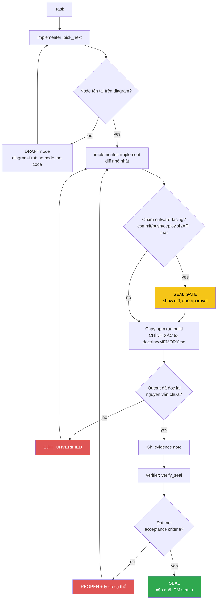

<!-- Diagram: dev-loop -->
<!-- Dev loop: plan - implement - verify - seal -->
DNA: 'smallest_diff / edit_x_read_back_proof_x_independent_verdict'
Auth: 65537 | Version: 1.0.0
Law: LAI-13 - monotonic ratchet (PENDING -> IN_PROGRESS -> SEALED, never demote)

> Mọi thay đổi tới repo code đi vào đây và đi ra bằng SEALED hoặc REOPENED —
> không có trạng thái nào khác ở giữa.

## PM status
| Node | State | Notes |
|---|---|---|
| `hub-init` | PENDING | Placeholder — chưa có task thật nào chạy qua `/worker` sau khi hub được khởi tạo (2026-08-20). Việc khởi tạo hub bản thân nó nằm NGOÀI vòng implementer/verifier (bootstrap một lần), nên không tự SEAL — node đầu tiên sẽ do `/worker implementer "<task>"` thật tạo ra qua `pick_next`. |
| `issue-1-router-history` | SEALED | [issue #1](https://github.com/datvt243/vue-resume-web/issues/1) — `createMemoryHistory` → `createWebHashHistory`. Evidence: `evidence/implementer/2026-08-20-issue-1-router-history.md`, `evidence/verifier/2026-08-20-issue-1-router-history.md`. |
| `issue-2-login-post` | SEALED | [issue #2](https://github.com/datvt243/vue-resume-web/issues/2) — login GET→POST, params→data. Backend cần chấp nhận POST body (ngoài phạm vi repo này). Evidence: `evidence/implementer/2026-08-20-issue-2-login-post.md`, `evidence/verifier/2026-08-20-issue-2-login-post.md`. |
| `issue-3-veeform-mutate-props` | SEALED | [issue #3](https://github.com/datvt243/vue-resume-web/issues/3) — `delete e.valid` → destructuring, hết mutate `props.fields`. Evidence: `evidence/implementer/2026-08-20-issue-3-veeform-mutate-props.md`, `evidence/verifier/2026-08-20-issue-3-veeform-mutate-props.md`. |
| `issue-4-veeform-reset-typo` | SEALED | [issue #4](https://github.com/datvt243/vue-resume-web/issues/4) — `e.nam`→`e.name`, sửa `reduce` thiếu initialValue, `errors:`→`values:`. Evidence: `evidence/implementer/2026-08-20-issue-4-veeform-reset-typo.md`, `evidence/verifier/2026-08-20-issue-4-veeform-reset-typo.md`. |
| `issue-5-xss-vhtml-toast` | SEALED | [issue #5](https://github.com/datvt243/vue-resume-web/issues/5) — bỏ `v-html` khỏi Toasts.vue, bỏ ` ` HTML khỏi base.js. Evidence: `evidence/implementer/2026-08-20-issue-5-xss-vhtml-toast.md`, `evidence/verifier/2026-08-20-issue-5-xss-vhtml-toast.md`. |

Any regression phải là **node mới** (LAI-13) — không được sửa trực tiếp PM
status của node cũ để "gỡ" một SEAL đã có.
