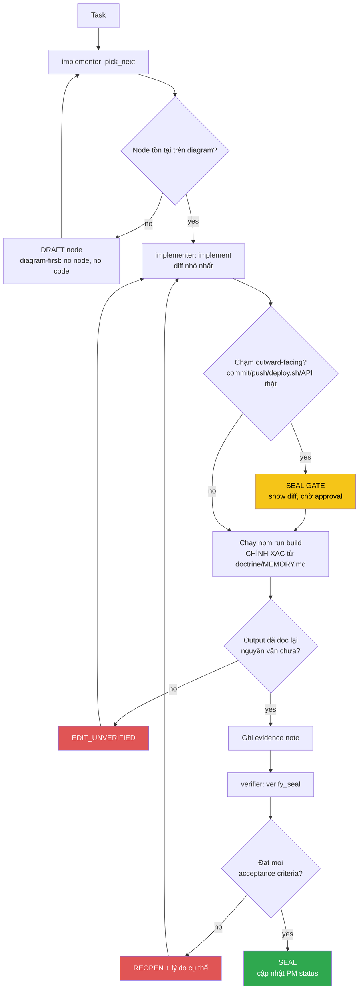

<!-- Diagram: dev-loop -->
<!-- Dev loop: plan - implement - verify - seal -->
DNA: 'smallest_diff / edit_x_read_back_proof_x_independent_verdict'
Auth: 65537 | Version: 1.0.0
Law: LAI-13 - monotonic ratchet (PENDING -> IN_PROGRESS -> SEALED, never demote)

> Mọi thay đổi tới repo code đi vào đây và đi ra bằng SEALED hoặc REOPENED —
> không có trạng thái nào khác ở giữa.

## PM status
| Node | State | Notes |
|---|---|---|
| `hub-init` | PENDING | Placeholder — chưa có task thật nào chạy qua `/worker` sau khi hub được khởi tạo (2026-08-20). Việc khởi tạo hub bản thân nó nằm NGOÀI vòng implementer/verifier (bootstrap một lần), nên không tự SEAL — node đầu tiên sẽ do `/worker implementer "<task>"` thật tạo ra qua `pick_next`. |
| `issue-1-router-history` | SEALED | [issue #1](https://github.com/datvt243/vue-resume-web/issues/1) — `createMemoryHistory` → `createWebHashHistory`. Evidence: `evidence/implementer/2026-08-20-issue-1-router-history.md`, `evidence/verifier/2026-08-20-issue-1-router-history.md`. |
| `issue-2-login-post` | SEALED | [issue #2](https://github.com/datvt243/vue-resume-web/issues/2) — login GET→POST, params→data. Backend cần chấp nhận POST body (ngoài phạm vi repo này). Evidence: `evidence/implementer/2026-08-20-issue-2-login-post.md`, `evidence/verifier/2026-08-20-issue-2-login-post.md`. |
| `issue-3-veeform-mutate-props` | SEALED | [issue #3](https://github.com/datvt243/vue-resume-web/issues/3) — `delete e.valid` → destructuring, hết mutate `props.fields`. Evidence: `evidence/implementer/2026-08-20-issue-3-veeform-mutate-props.md`, `evidence/verifier/2026-08-20-issue-3-veeform-mutate-props.md`. |
| `issue-4-veeform-reset-typo` | SEALED | [issue #4](https://github.com/datvt243/vue-resume-web/issues/4) — `e.nam`→`e.name`, sửa `reduce` thiếu initialValue, `errors:`→`values:`. Evidence: `evidence/implementer/2026-08-20-issue-4-veeform-reset-typo.md`, `evidence/verifier/2026-08-20-issue-4-veeform-reset-typo.md`. |
| `issue-5-xss-vhtml-toast` | SEALED | [issue #5](https://github.com/datvt243/vue-resume-web/issues/5) — bỏ `v-html` khỏi Toasts.vue, bỏ ` ` HTML khỏi base.js. Evidence: `evidence/implementer/2026-08-20-issue-5-xss-vhtml-toast.md`, `evidence/verifier/2026-08-20-issue-5-xss-vhtml-toast.md`. |
| `issue-8-jwt-localstorage` | BLOCKED_ON_BACKEND | [issue #8](https://github.com/datvt243/vue-resume-web/issues/8) — cần backend set httpOnly cookie, ngoài phạm vi repo frontend. Không tạo diff giả. Issue giữ OPEN. Evidence: `evidence/implementer/2026-08-20-issue-8-jwt-localstorage-blocked.md`. |
| `issue-9-usehelper-reactive-loading` | SEALED | [issue #9](https://github.com/datvt243/vue-resume-web/issues/9) — `useHelper` trả Ref thay vì snapshot; `base.js` + `auth.js` unwrap qua `toValue()`. Evidence: `evidence/implementer/2026-08-20-issue-9-usehelper-reactive-loading.md`, `evidence/verifier/2026-08-20-issue-9-usehelper-reactive-loading.md`. |
| `issue-10-grouptags-mutate-prop` | SEALED | [issue #10](https://github.com/datvt243/vue-resume-web/issues/10) — local copy + emit thay vì mutate prop; sửa luôn tên emit `modelValue:update`→`update:modelValue` (cần thiết để v-model hoạt động). Evidence: `evidence/implementer/2026-08-20-issue-10-grouptags-mutate-prop.md`, `evidence/verifier/2026-08-20-issue-10-grouptags-mutate-prop.md`. |
| `issue-11-pageinformation-duplicate-key` | SEALED | [issue #11](https://github.com/datvt243/vue-resume-web/issues/11) — 2 `<VeeForm>` cùng `:key="'frm1'"` → key riêng biệt. Evidence: `evidence/implementer/2026-08-20-issue-11-pageinformation-duplicate-key.md`, `evidence/verifier/2026-08-20-issue-11-pageinformation-duplicate-key.md`. |
| `issue-12-token-refresh` | SEALED | [issue #12](https://github.com/datvt243/vue-resume-web/issues/12) — lưu `tokenRefresh` + axios interceptor silent refresh khi 401. Cần backend có `POST auth/refresh` (ngoài phạm vi repo này, caveat ghi rõ). Evidence: `evidence/implementer/2026-08-20-issue-12-token-refresh.md`, `evidence/verifier/2026-08-20-issue-12-token-refresh.md`. |
| `issue-17-suburl-dry` | SEALED | [issue #17](https://github.com/datvt243/vue-resume-web/issues/17) — `subURL` gộp về `api.config.js` (chỉ phần DRY, không làm env-var migration của issue #6). Evidence: `evidence/implementer/2026-08-20-issue-17-suburl-dry.md`, `evidence/verifier/2026-08-20-issue-17-suburl-dry.md`. |
| `issue-18-dead-code` | SEALED | [issue #18](https://github.com/datvt243/vue-resume-web/issues/18) — xóa `handleBaseDelete`, `_part`, `components/navbar/*.js`, unused `ref`/`TOKEN`. Không bật ESLint rule (không verify được). Evidence: `evidence/implementer/2026-08-20-issue-18-dead-code.md`, `evidence/verifier/2026-08-20-issue-18-dead-code.md`. |
| `issue-19-tabledefault-merge-style` | SEALED | [issue #19](https://github.com/datvt243/vue-resume-web/issues/19) — gộp 2 khối `<style scoped>` trong TableDefault.vue thành 1. Evidence: `evidence/implementer/2026-08-20-issue-19-tabledefault-merge-style.md`, `evidence/verifier/2026-08-20-issue-19-tabledefault-merge-style.md`. |
| `issue-34-converttotruncate-length` | SEALED | [issue #34](https://github.com/datvt243/vue-resume-web/issues/34) — `ConvertToTruncate` gọi `value.length(25)` như hàm, crash Award/Experience list. Đổi thành so sánh độ dài + `slice`. Evidence: `evidence/implementer/2026-08-20-issue-34-converttotruncate-length.md`, `evidence/verifier/2026-08-20-issue-34-converttotruncate-length.md`. |
| `issue-35-axios-network-error` | SEALED | [issue #35](https://github.com/datvt243/vue-resume-web/issues/35) — `_axios` reject `err.response?.data` (undefined khi lỗi mạng), `base.js`/`auth.js` destructure thẳng → throw, spinner treo. Đổi sang fallback object mặc định khi không có `response`. Evidence: `evidence/implementer/2026-08-20-issue-35-axios-network-error.md`, `evidence/verifier/2026-08-20-issue-35-axios-network-error.md`. |
| `issue-low-batch-cleanup` | SEALED | Batch fix cho 9 issue LOW severity trong 1 commit (theo yêu cầu operator): [#46](https://github.com/datvt243/vue-resume-web/issues/46) Dropdown ref binding, [#47](https://github.com/datvt243/vue-resume-web/issues/47) FrmArray FieldArray/Field chưa import + hardcode name, [#48](https://github.com/datvt243/vue-resume-web/issues/48) FrmCheckbox thiếu `:` binding, [#49](https://github.com/datvt243/vue-resume-web/issues/49) regex số điện thoại, [#50](https://github.com/datvt243/vue-resume-web/issues/50) Header.vue dead prop `is-login`, [#51](https://github.com/datvt243/vue-resume-web/issues/51) LayoutDefault `$route.path`/`$route.fullPath` không nhất quán, [#52](https://github.com/datvt243/vue-resume-web/issues/52) đổi tên `generalInformation.modal.ts` → `.model.ts`, [#53](https://github.com/datvt243/vue-resume-web/issues/53) experience.model `_id` dùng `defaultId`, [#54](https://github.com/datvt243/vue-resume-web/issues/54) certificate.model thiếu `.trim()`. Evidence: `evidence/implementer/2026-08-20-issue-low-batch-cleanup.md`, `evidence/verifier/2026-08-20-issue-low-batch-cleanup.md`. |

Any regression phải là **node mới** (LAI-13) — không được sửa trực tiếp PM
status của node cũ để "gỡ" một SEAL đã có.
